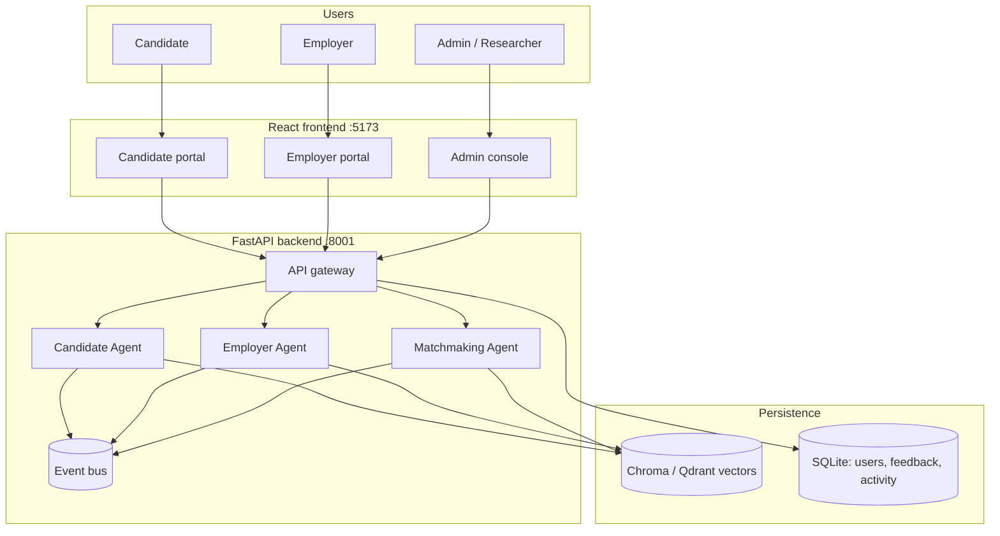

# Job-Matching-Agentic

A **multi-agent job matching platform** where candidates and employers each have their own portal, and a neutral **Matchmaking Agent** ranks fit between people and roles using explainable ML scoring.

Built as a thesis research demo: three collaborating agents, a bootstrapped evaluation corpus (30 CVs, 15 jobs), role-based web UI, and benchmark drivers for reproducible evaluation.

---

## Table of contents

1. [What this project is](#what-this-project-is)
2. [Who it is for](#who-it-is-for)
3. [How it works (high level)](#how-it-works-high-level)
4. [The three agents](#the-three-agents)
5. [User roles and journeys](#user-roles-and-journeys)
6. [Matching and scoring](#matching-and-scoring)
7. [Features by area](#features-by-area)
8. [Tech stack](#tech-stack)
9. [Prerequisites](#prerequisites)
10. [Setup and run locally](#setup-and-run-locally)
11. [Environment variables](#environment-variables)
12. [Demo accounts and walkthrough](#demo-accounts-and-walkthrough)
13. [API reference](#api-reference)
14. [Data and corpus](#data-and-corpus)
15. [Testing](#testing)
16. [Benchmarks (research)](#benchmarks-research)
17. [Project layout](#project-layout)
18. [Design documentation](#design-documentation)
19. [Troubleshooting](#troubleshooting)

**Folder READMEs:** Every major module has a local guide · see [Folder guides](#folder-guides) under Project layout.

---

## What this project is

Traditional job boards treat matching as a single search box: keywords in, listings out. This system models hiring as **collaboration between two sides**:

- A **Candidate Agent** represents job seekers · it owns resumes, skills, embeddings, and profile state.
- An **Employer Agent** represents hiring teams · it owns job descriptions, requirements, and job embeddings.
- A **Matchmaking Agent** sits in the middle · it **reads** from both sides (never writes to their stores) and produces ranked, explainable matches.

The web app exposes three **role portals** (Candidate, Employer, Admin) plus session auth. Product users see match percentages, skill gaps, and plain-language explanations. Researchers and evaluators use the admin console for raw strategies, ensemble runs, and benchmark parity.

---

## Who it is for

| Audience | What you get |
|----------|--------------|
| **Supervisors / stakeholders** | A 15-minute demo with real portals (see [docs/demo/DEMO-SCRIPT.md](docs/demo/DEMO-SCRIPT.md)) |
| **Developers onboarding** | This README + [HLD](docs/design/HLD-multi-agent-system.md) + [SDD](docs/design/SDD-multi-agent-system.md) |
| **Researchers** | Fixed 30/15 corpus, graded pairs, benchmark scripts under `backend/benchmarks/` |
| **Thesis authors** | Architecture that maps to a three-agent paper diagram; v1/v2 scope in [V1-V2-SCOPE.md](docs/design/V1-V2-SCOPE.md) |

---

## How it works (high level)



**Typical match flow:**

1. User signs in → session cookie stored (HTTP-only).
2. Candidate uploads a resume or employer posts a job → LLM or manual form fills structured fields.
3. The owning agent validates, normalizes skills, embeds the document, and stores it in the vector store.
4. An event (`CandidateProfileUpdated` or `JobProfileUpdated`) notifies the Matchmaking Agent to invalidate caches.
5. User clicks **Find matches** → Matchmaking Agent scores every candidate–job pair (exhaustive over the corpus at demo scale), ranks by composite score, and returns results with breakdowns.
6. The UI opens a **match drawer** with component scores, matched/missing skills, resume coach tips, and similar roles/candidates.

---

## The three agents

Each agent has **clear ownership**. The Matchmaking Agent never mutates candidate or job data.

### Candidate Agent

| | |
|---|---|
| **Owns** | Resume profiles, skill normalization, candidate embeddings (`candidates_collection`) |
| **Does not own** | Jobs, match scores, employer state |
| **Triggers** | Resume upload, profile save, corpus bootstrap |
| **Events** | `CandidateProfileUpdated`, `CorpusBootstrapped` |

When a candidate saves their profile, the agent builds a canonical document string, computes a 384-d embedding (`all-MiniLM-L6-v2`), and upserts into Chroma (or Qdrant if switched).

### Employer Agent

| | |
|---|---|
| **Owns** | Job postings, required skills, job embeddings (`jobs_collection`) |
| **Does not own** | Candidates, final rankings |
| **Triggers** | JD paste/upload, job form save, corpus bootstrap |
| **Events** | `JobProfileUpdated` |

Employers can paste raw job description text or upload PDF/DOCX/TXT. An LLM extracts title, skills, experience, compensation, and location into a structured form for review before posting.

### Matchmaking Agent

| | |
|---|---|
| **Owns** | Scoring strategies, ranking, match session history, rule-based explanations |
| **Does not own** | Raw CVs/JDs, vector store writes |
| **Reads** | Snapshots + embeddings from both agents |
| **Events** | `MatchCompleted` |

Supports semantic-only, multimodal, composite (default in UI), and RRF ensemble strategies. Subscribes to profile-update events to keep match caches fresh.

---

## User roles and journeys

Register at `/register` and choose a role. Each role sees only its portal routes.

### Candidate journey

| Step | Route | What happens |
|------|-------|--------------|
| 1. Onboarding | `/candidate/onboarding` | Upload PDF/DOCX/TXT resume → AI extracts fields; CID artifacts stripped; contacts parsed (email, phone, GitHub, LinkedIn, etc.) |
| 2. Review profile | Same page, step 2 | Edit skills, experience, compensation expectations, links |
| 3. Save | `PUT /candidates/me` | Profile upserted (create or update · no duplicate error) |
| 4. Find jobs | `/candidate/matches` | Composite match ranks all jobs; filter by remote, experience, score band |
| 5. Details | Match drawer | Score breakdown, skill gaps, resume coach, similar jobs |
| 6. Actions | Save job, apply, not interested | Persisted in SQLite for UI state (ranking unchanged) |
| 7. Profile edits | `/candidate/profile` | Re-upload resume or edit fields; refresh matches without re-upload |

**Demo shortcut:** Sign in as `demo.candidate@test.com` · profile is pre-linked to **Rahul Sharma** in the corpus. Go straight to **Jobs → Find matches**.

### Employer journey

| Step | Route | What happens |
|------|-------|--------------|
| 1. Post a job | `/employer/jobs` | Paste JD text **or** upload file → **Extract details** → review form → post |
| 2. Find candidates | `/employer/matches` | Select a job → composite match ranks candidates |
| 3. Details | Match drawer | Breakdown, contact links, similar candidates |
| 4. Actions | Save, reject, contact | Persisted feedback for UI state |
| 5. Applications | `/employer/applications` | View in-app applications from candidates |

**Demo shortcut:** `demo.employer@test.com` has 5 sample jobs pre-seeded.

### Admin / researcher journey

| Step | Route | What happens |
|------|-------|--------------|
| 1. Agent health | `/admin/console` | Three agent cards: entity counts, store version, last event |
| 2. Manual match | Same page | Pick candidate, strategy, metric, skills mode → run match |
| 3. System config | API / console | Switch Chroma ↔ Qdrant, view supported strategies |
| 4. Events | Agent event strip | Last 50 bus events for debugging |

Admin is the **research console** · raw decimals, ensemble controls, and fairness baseline. Product users never need it.

---

## Matching and scoring

### Default: composite strategy

Portals send `strategy: "composite"` by default. The final score is a weighted blend of six signals:

| Component | Weight | What it measures |
|-----------|--------|------------------|
| **Semantic** | 28% | Embedding similarity (bi-encoder cosine) between resume and job text |
| **Skills** | 27% | Overlap between candidate skills and job required skills (Jaccard or soft embed) |
| **Title** | 10% | Token overlap between job title and candidate summary/skills |
| **Experience** | 15% | Years of experience vs job requirement |
| **Compensation** | 10% | Salary expectation vs job budget range |
| **Remote** | 10% | Remote-preference alignment |

### Score bands (UI)

| Band | Threshold | Meaning |
|------|-----------|---------|
| **Strong** | ≥ 80% | Excellent fit across most signals |
| **Good** | ≥ 65% | Solid fit; review skill gaps |
| **Moderate** | ≥ 50% | Partial fit; may need upskilling |
| **Low** | < 50% | Weak fit |

List cards show **final % + band**. The **match drawer** shows all five component scores as progress bars, plus matched and missing skills.

### Other strategies (API / admin)

| Strategy | Description |
|----------|-------------|
| `semantic` | Embedding similarity only (legacy default for benchmarks) |
| `multimodal` | Weighted blend of semantic + skills (α = 0.7 semantic) |
| `composite` | Five-signal weighted blend (product default) |
| `ensemble` | Reciprocal Rank Fusion (RRF, k=60) over multiple strategy×metric lists |

### Retrieval mode

- **UI match requests:** Exhaustive scoring over the full corpus (~30 candidates × ~15 jobs at demo scale).
- **Daily batch:** ANN shortlist via agent vector search → JSON artifact in `data/daily_recommendations_*.json`.

### Explainability

- **Rule-based bullets** (`why_ranked`) on admin results.
- **Plain-language summary** in the product drawer.
- **Resume coach** (`POST /candidates/me/resume-suggestions`): read-only, role-targeted tips · does not modify the profile.

---

## Features by area

| Area | What you can do |
|------|-----------------|
| **Auth** | Register, login, logout; HTTP-only session cookie; role-guarded routes |
| **Resume ingest** | PDF/DOCX/TXT upload; strip `(cid:N)` PDF artifacts; regex + LLM field extraction |
| **JD ingest** | File upload or paste raw text → same LLM parser path |
| **Profile upsert** | `PUT /candidates/me` creates or updates in one call |
| **Matching** | Candidate→jobs and job→candidates; composite default; filters on results |
| **Match drawer** | Score breakdown, skill gaps, resume coach, 3 similar entities |
| **Feedback** | Save / apply / not interested (candidate); save / reject / contact (employer) · SQLite, UI-only |
| **Saved jobs & applications** | Candidate bookmarks; employer applicant feed |
| **Admin ML** | Vector store switch (Chroma/Qdrant), ensemble weights, fairness baseline |
| **UX** | Warm neutral design system; shared form/results/empty-state components; subtle animated SVG backgrounds on all portals |

---

## Tech stack

| Layer | Technology |
|-------|------------|
| **Frontend** | React 19, Vite 6, React Router 7, axios |
| **Backend** | Python 3.11+, FastAPI, Uvicorn, Pydantic v2 |
| **Embeddings** | `sentence-transformers` · `all-MiniLM-L6-v2` (384-d) |
| **Vector store** | Chroma (default, persistent under `backend/chroma_db/`) or Qdrant |
| **Auth & activity** | SQLite (users, sessions, feedback, saved jobs, applications) |
| **LLM parsing** | Ollama (`llama3.2`) by default; OpenAI (`gpt-4o-mini`) when `OPENAI_API_KEY` is set |
| **Resume/JD files** | pdfplumber (PDF), python-multipart (uploads) |
| **Tests** | pytest (backend + integration), Node built-in test runner (frontend utils) |

---

## Prerequisites

| Requirement | Notes |
|-------------|-------|
| **Python 3.11+** | 3.11 recommended; venv required |
| **Node.js 18+** | For frontend dev server and build |
| **~2 GB disk** | Embedding model downloads on first run |
| **Ollama** (optional) | For AI resume/JD extraction without OpenAI |
| **OpenAI API key** (optional) | Alternative to Ollama for parsing |

You do **not** need Docker, Redis, or an external database for local demo. Chroma and SQLite run in-process.

---

## Setup and run locally

### 1. Clone and open the repo

```bash
git clone https://anonymous.4open.science/r/JobMatch
cd Job-Matching-Agentic
```

### 2. Backend

```bash
cd backend
python3.11 -m venv .venv
source .venv/bin/activate          # Windows: .venv\Scripts\activate
pip install -r requirements-min.txt

cp .env.example .env               # first time only
# Optional: set OPENAI_API_KEY in .env

uvicorn main:create_app --factory --reload --port 8001
```

On first startup the backend:

- Bootstraps the evaluation corpus from `data/cvs.json` and `data/jobs.json`
- Builds Chroma embeddings (may take 1–2 minutes)
- Seeds demo accounts if `SEED_DEMO=true`

**Verify:** Open http://localhost:8001/docs · you should see the Swagger UI.  
**Verify agents:** `curl -s http://localhost:8001/agents/status | python3 -m json.tool`

### 3. Frontend (separate terminal)

```bash
cd frontend
npm install
npm run dev
```

**Verify:** Open http://localhost:5173 (landing page with Login / Register).

### 4. Optional: Ollama for resume/JD parsing

Without OpenAI or Ollama, resume/JD upload still works: you get cleaned text + regex-extracted contacts, then fill fields manually.

```bash
ollama pull llama3.2
ollama serve    # if not already running
```

---

## Environment variables

Copy `backend/.env.example` to `backend/.env` (gitignored). Never commit real keys.

| Variable | Default | Purpose |
|----------|---------|---------|
| `OPENAI_API_KEY` | (empty) | Use OpenAI for resume/JD parsing instead of Ollama |
| `OPENAI_BASE_URL` | `https://api.openai.com/v1` | OpenAI-compatible endpoint (Azure, LiteLLM, etc.) |
| `OLLAMA_BASE_URL` | `http://localhost:11434` | Local Ollama server |
| `OLLAMA_MODEL` | `llama3.2` | Model for local parsing |
| `SESSION_SECRET` | `dev-change-me` | Signs auth cookies · **change in production** |
| `HOST` | `0.0.0.0` | Bind address |
| `PORT` | `8001` | API port |
| `SEED_DEMO` | `true` | Auto-create demo accounts on startup |
| `VECTOR_STORE` | `chroma` | `chroma` or `qdrant` |
| `READ_ONLY` | `false` | When `true`, blocks mutating API except auth login/register |

**Production:** inject secrets via your host's environment (Render, Railway, Fly, AWS, etc.). Do not deploy a `.env` file with real keys.

---

## Demo accounts and walkthrough

Demo accounts are created automatically when `SEED_DEMO=true` (default).

| Role | Email | Password | Pre-loaded state |
|------|-------|----------|------------------|
| **Candidate** | `demo.candidate@test.com` | `demo1234` | Profile linked to Rahul Sharma · instant job matches |
| **Employer** | `demo.employer@test.com` | `demo1234` | 5 sample job postings |
| **Admin** | `demo.admin@test.com` | `demo1234` | Full research console access |

Disable seeding: set `SEED_DEMO=false` in `backend/.env`.

### 15-minute demo script

Full narrative: **[docs/demo/DEMO-SCRIPT.md](docs/demo/DEMO-SCRIPT.md)**  
Pre-flight checks: **[docs/demo/DEMO-CHECKLIST.md](docs/demo/DEMO-CHECKLIST.md)**

**Quick path:**

1. **Candidate** · Login → Jobs → **Find matches** → open drawer (breakdown, gaps, coach, similar jobs)
2. **Employer** · Login → My jobs → paste a JD → **Extract details** → post → Candidates → match drawer
3. **Admin** · Login → Match console → run composite match for **Rahul Sharma** → ML Engineer at rank 1

Expected top match: **Rahul Sharma ↔ Machine Learning Engineer** with strong semantic and skills overlap.

---

## API reference

Interactive docs: http://localhost:8001/docs (Swagger) and `/redoc`.

### Authentication

All portal routes require a session cookie. Register or login first; the frontend stores the cookie automatically.

| Method | Route | Description |
|--------|-------|-------------|
| `POST` | `/auth/register` | Create account `{ email, password, role }` · role: `candidate`, `employer`, or `admin` |
| `POST` | `/auth/login` | Sign in → sets HTTP-only session cookie |
| `POST` | `/auth/logout` | Clear session |
| `GET` | `/auth/me` | Current user `{ id, email, role }` |

Registration emails must use a valid domain (e.g. `@example.com`, `@test.com`).

### Agents and system

| Method | Route | Description |
|--------|-------|-------------|
| `GET` | `/agents/status` | Health: entity counts, store version, last event per agent |
| `GET` | `/agents/events/recent` | Last 50 event-bus messages (admin debugging) |
| `GET` | `/system/config` | Supported strategies, metrics, vector store, read-only flag |
| `POST` | `/system/vector-store` | Switch Chroma ↔ Qdrant and reindex |

### Candidates

| Method | Route | Auth | Description |
|--------|-------|------|-------------|
| `GET` | `/candidates` | · | List candidate names |
| `GET` | `/candidates/me` | Candidate | Get owned profile (404 if none yet) |
| `PUT` | `/candidates/me` | Candidate | Upsert owned profile (create or update) |
| `POST` | `/candidates/upload-resume` | Candidate | PDF/DOCX/TXT → extracted fields + cleaned text |
| `POST` | `/candidates/me/resume-suggestions` | Candidate | Read-only resume tips for a job `{ job_id }` |
| `GET` | `/candidates/me/saved-jobs` | Candidate | List saved job IDs |
| `PUT` | `/candidates/me/saved-jobs` | Candidate | Toggle saved job `{ job_id }` |
| `POST` | `/candidates/me/applications` | Candidate | Record in-app application `{ job_id }` |

### Jobs (employer)

| Method | Route | Auth | Description |
|--------|-------|------|-------------|
| `GET` | `/jobs` | · | List job titles |
| `GET` | `/jobs/mine` | Employer | List owned jobs |
| `PUT` | `/jobs/mine/{job_id}` | Employer | Update owned job |
| `POST` | `/jobs/upload-description` | Employer | PDF/DOCX/TXT → extracted JD fields |
| `POST` | `/jobs/parse-description` | Employer | Raw JD text → extracted fields |
| `GET` | `/jobs/mine/applications` | Employer | Applicants for owned jobs |

### Matching

| Method | Route | Description |
|--------|-------|-------------|
| `POST` | `/match/candidate-to-jobs` | `{ query_key, top_k, strategy, ... }` → ranked jobs |
| `POST` | `/match/job-to-candidates` | `{ query_key, top_k, strategy, ... }` → ranked candidates |
| `POST` | `/match/ensemble` | RRF over multiple strategy×metric combos |
| `POST` | `/match/daily-batch` | ANN daily recommendations → JSON artifact |

**Example · composite match:**

```bash
curl -s -X POST http://localhost:8001/match/candidate-to-jobs \
  -H 'Content-Type: application/json' \
  -d '{"query_key":"Rahul Sharma","top_k":3,"strategy":"composite"}' \
  | python3 -m json.tool
```

Legacy aliases still work: `/match-resume`, `/match-job`, `/match-resume-ensemble`, `/agent/run-daily-recommendations`.

### Similar entities and feedback

| Method | Route | Auth | Description |
|--------|-------|------|-------------|
| `GET` | `/similar/jobs/{job_id}` | Candidate | Up to 3 similar jobs |
| `GET` | `/similar/candidates/{candidate_id}` | Employer | Up to 3 similar candidates |
| `POST` | `/feedback/actions` | Portal | `{ action, entity_type, entity_id, context_id? }` |
| `GET` | `/feedback/me` | Portal | Latest feedback for UI state |
| `POST` | `/feedback` | · | Legacy pair feedback for research/boost |

Feedback actions do **not** change match rankings · they only drive UI state (saved, rejected, etc.).

---

## Data and corpus

| File | Contents |
|------|----------|
| `data/cvs.json` | 30 structured candidate profiles (evaluation corpus) |
| `data/jobs.json` | 15 structured job postings |
| `data/eval_pairs.json` | 47 graded candidate–job pairs for benchmark regression |
| `data/daily_recommendations_*.json` | Output from daily-batch ANN runs |

On startup, agents load CVs and jobs into memory and Chroma. User-created profiles and jobs are added alongside the corpus. The demo candidate account is linked to **Rahul Sharma** from this corpus.

Vector embeddings persist under `backend/chroma_db/` (or Qdrant if configured). Delete that folder to force a full reindex.

---

## Testing

```bash
# Backend + integration (from repo root)
cd backend && source .venv/bin/activate
pytest ../tests -q

# Frontend unit tests (match format, skills, feedback, profile, backgrounds)
node --test tests/unit/frontend/test_*.mjs

# Full suite (pytest + node)
bash scripts/run_tests.sh

# Feature checklist · composite, JD parse, feedback, CID cleanup, profile upsert
pytest tests/integration/test_feature_reverification.py -q

# Employer jobs API smoke (backend must be running on :8001)
python3 scripts/smoke_employer_jobs.py

# Production bundle check
cd frontend && npm run build
```

**Expected:** **302 pytest** + **39 node** tests pass.

Key test areas:

| Area | Test file(s) |
|------|--------------|
| Composite scoring | `test_feature_reverification.py`, scoring unit tests |
| Profile upsert | `test_candidate_profile_flow.py`, `test_profile_fields.mjs` |
| Resume CID cleanup | `test_resume_clean.py`, `test_contact_extract.py` |
| Feedback persistence | `test_feedback_store.py` |
| JD parse | integration reverification + employer route tests |

---

## Benchmarks (research)

From `backend/` with venv active. Outputs go to `backend/benchmark_outputs/`.

```bash
python -m benchmarks.smoke_eval
python -m benchmarks.paper_progression --skip-cross-encoder
python -m benchmarks.phase11 --stores chroma
```

These reproduce paper Table 9 regression gates and progression metrics against the fixed corpus. See [V1-V2-SCOPE.md](docs/design/V1-V2-SCOPE.md) for what is in v1 vs v2.

### ESWA submission — one-command reproduction

The scientific evaluation for the ESWA manuscript lives under `research/` (control plane) and
regenerates every reported number from committed artifacts.

```bash
# 1. install research deps (in addition to backend/requirements-min.txt)
backend/.venv/bin/pip install -r backend/requirements-research.txt   # scikit-learn, scipy, xgboost, matplotlib

# 2. reproduce all experiments -> tables/figures -> numeric gate (deterministic, seed 42)
bash scripts/reproduce_all.sh
```

This runs EXP-011..033 (extended evaluation, baselines incl. LambdaMART/JobBERT, held-out
calibration + calibration-method comparison, job/candidate/both-unseen generalization, 6-channel
ablation, weight-stability, protocol-gated 25-config model selection, mechanistic explanation
faithfulness, robustness matrix, temporal-drift simulation, failure injection, architecture value,
significance + Holm), then auto-generates the manuscript tables (`docs/submission/eswa/manuscript/tables/*.tex`)
and the held-out reliability figure, and finally runs the numerical consistency checker
(`research/experiments/verify_paper_numbers.py`), which fails the run on any stale/forbidden number.
The scalability micro-benchmark is opt-in (`RUN_SCALABILITY=1`) and the LLM-assisted label expansion
needs a local `claude -p` (run separately). Every result is seed-pinned and single-threaded
(`PYTHONHASHSEED=0 OMP_NUM_THREADS=1 MKL_NUM_THREADS=1 TOKENIZERS_PARALLELISM=false`).

Provenance and audit trail:

- `research/EXPERIMENT_REGISTRY.yaml` — every experiment (ID, dataset, seed, repro command, result).
- `research/results/MANUSCRIPT_NUMBERS.json` — each headline number mapped to its source artifact.
- `research/reports/FINAL_AUDIT.md`, `FINAL_NUMERICAL_AUDIT.md`, `FINAL_REPRODUCTION.md`,
  `FINAL_DOCUMENT_AUDIT.md`, `FINAL_REVIEW.md` — the final audit deliverables.
- `research/datasets/synthetic_v1/` — the deterministic synthetic corpus (transparent latent ground
  truth; used only for controlled recovery/stress/scale probes, never as human judgments).

Expected headline results: composite nDCG@5 = 0.949 (ranking parity — no method significantly better
after Holm at n=30); held-out ECE 0.019 (with a reported low-discrimination caveat); unseen
candidate/job/both generalization ≈ 0.93. Numbers are CPU-deterministic; a different BLAS/threading
setup may shift the last digit of a bootstrap CI bound.

---

## Project layout

Each major folder has its own **README** with module details, key files, and links to children.

### Folder guides

| Path | Description |
|------|-------------|
| [backend/](backend/README.md) | Python API · agents, scoring, gateway |
| [backend/agents/](backend/agents/README.md) | Three domain agents |
| [backend/auth/](backend/auth/README.md) | Session auth and ownership |
| [backend/benchmarks/](backend/benchmarks/README.md) | Evaluation drivers |
| [backend/bus/](backend/bus/README.md) | Event bus |
| [backend/contracts/](backend/contracts/README.md) | Pydantic DTOs |
| [backend/core/](backend/core/README.md) | Scoring, resume/JD processing |
| [backend/gateway/](backend/gateway/README.md) | FastAPI app |
| [backend/gateway/routes/](backend/gateway/routes/README.md) | HTTP route modules |
| [backend/hooks/](backend/hooks/README.md) | LLM parser, explainer |
| [backend/stores/](backend/stores/README.md) | Vector + SQLite stores |
| [frontend/](frontend/README.md) | React app setup |
| [frontend/src/](frontend/src/README.md) | Source entry and routing |
| [frontend/src/pages/](frontend/src/pages/README.md) | Portal pages |
| [frontend/src/pages/candidate/](frontend/src/pages/candidate/README.md) | Candidate portal |
| [frontend/src/pages/employer/](frontend/src/pages/employer/README.md) | Employer portal |
| [frontend/src/pages/admin/](frontend/src/pages/admin/README.md) | Admin console |
| [frontend/src/components/](frontend/src/components/README.md) | Shared UI |
| [frontend/src/api/](frontend/src/api/README.md) | HTTP client |
| [frontend/src/utils/](frontend/src/utils/README.md) | Helpers |
| [frontend/src/layouts/](frontend/src/layouts/README.md) | Portal shells |
| [docs/](docs/README.md) | Design docs and demo scripts |
| [docs/design/](docs/design/README.md) | HLD, SDD, scope |
| [docs/demo/](docs/demo/README.md) | Demo script and checklist |
| [docs/session/](docs/session/README.md) | Session notes |
| [data/](data/README.md) | Evaluation corpus |
| [tests/](tests/README.md) | Test suite overview |
| [tests/unit/](tests/unit/README.md) | Unit tests |
| [tests/integration/](tests/integration/README.md) | Integration tests |
| [scripts/](scripts/README.md) | Smoke scripts |

### Tree (summary)

```
Job-Matching-Agentic/
├── backend/           → backend/README.md
│   ├── agents/        → three agents
│   ├── auth/          → sessions + ownership
│   ├── benchmarks/    → paper_progression, phase11
│   ├── core/          → composite scoring, resume clean
│   ├── gateway/       → FastAPI + routes/
│   ├── hooks/         → LLM parser
│   ├── stores/        → Chroma, SQLite
│   ├── main.py        → app factory
│   └── demo_seed.py   → demo accounts
├── frontend/          → frontend/README.md
│   └── src/           → pages/, components/, api/, utils/
├── tests/             → tests/README.md
├── data/              → cvs.json, jobs.json, eval_pairs.json
├── docs/              → design/, demo/, session/
└── scripts/           → smoke utilities
```

---

## Design documentation

| Document | Description |
|----------|-------------|
| [HLD · multi-agent system](docs/design/HLD-multi-agent-system.md) | Architecture, agent boundaries, event bus, diagrams |
| [SDD · multi-agent system](docs/design/SDD-multi-agent-system.md) | Detailed software design, module specs, API contracts |
| [V1 vs V2 scope](docs/design/V1-V2-SCOPE.md) | What shipped in v1/v1.1 vs planned v2 ML |
| [V1.1 role portals + auth](docs/design/v1.1-role-portals-auth.md) | Auth model, portal routes, ownership |
| [Session summary 2026-05-27](docs/session/SESSION-2026-05-27.md) | Recent feature work and decisions |
| [JAAMAS submission](docs/submission/jaamas/build/README.md) | Manuscript PDF, Overleaf zip, figure pipeline |

---

## JAAMAS submission (thesis paper)

**Authors:** Anonymous Author, Anonymous Author (Anonymous Institution)  
**Supervisor:** Dr Anonymous Supervisor (Anonymous University)

| Artifact | Path |
|----------|------|
| Compiled PDF | `docs/submission/jaamas/manuscript/main.pdf` |
| Overleaf zip | `docs/submission/jaamas/build/jaamas-overleaf-upload.zip` |
| Figure sources | `docs/submission/jaamas/figures/` (Fig 1 draw.io; Figs 2–9 Mermaid; Fig 10 screenshots) |
| Rebuild all | `bash docs/submission/jaamas/build_all.sh` |
| Screenshot capture | `cd docs/submission/jaamas/figures/scripts && node capture_portal_screenshots.mjs` |

Figure 10 includes eight portal screenshots (candidate onboarding through admin match run). See [figures/README.md](docs/submission/jaamas/figures/README.md).

---

## Troubleshooting

| Problem | Likely cause | Fix |
|---------|--------------|-----|
| Backend slow on first start | Embedding model download + corpus index | Wait 1–2 min; check terminal for bootstrap logs |
| Resume upload returns empty fields | Ollama not running and no OpenAI key | Start Ollama or set `OPENAI_API_KEY`; manual entry still works |
| Jobs page says "Complete your profile" | No profile saved yet | Upload resume → save profile via onboarding or `/candidate/profile` |
| "Profile already exists" on save | Old bug · should not happen | Use latest code; save uses `PUT /candidates/me` upsert only |
| Match returns no results | Corpus not bootstrapped | Restart backend; check `/agents/status` for candidate/job counts |
| Frontend can't reach API | Wrong port or CORS | Backend on `:8001`, frontend on `:5173`; check `frontend/vite.config` proxy |
| Demo admin login fails in scripts | Session timing / stale cookie | Use fresh register or retry login; candidate/employer demos are more reliable |
| Chroma errors after code changes | Stale index | Delete `backend/chroma_db/` and restart |
| Tests fail on embedding | First-run model download | Run once with network; model caches locally |

### Manual smoke checklist

1. Backend + frontend running (see Setup).
2. `GET /agents/status` → ~30 candidates, ~15 jobs, 3 agents healthy.
3. Admin login → composite match **Rahul Sharma** → **Machine Learning Engineer** rank 1.
4. Candidate demo → Jobs → Find matches → drawer shows five component scores.
5. Employer demo → paste JD → Extract details → post → find candidates.
6. Fresh register → upload resume → save profile → find jobs.

---

## License and attribution

Thesis research project by **Anonymous Author** and **Anonymous Author** (Anonymous Institution), supervised by **Dr Anonymous Supervisor** (Anonymous University). JAAMAS manuscript and figures: `docs/submission/jaamas/`.
