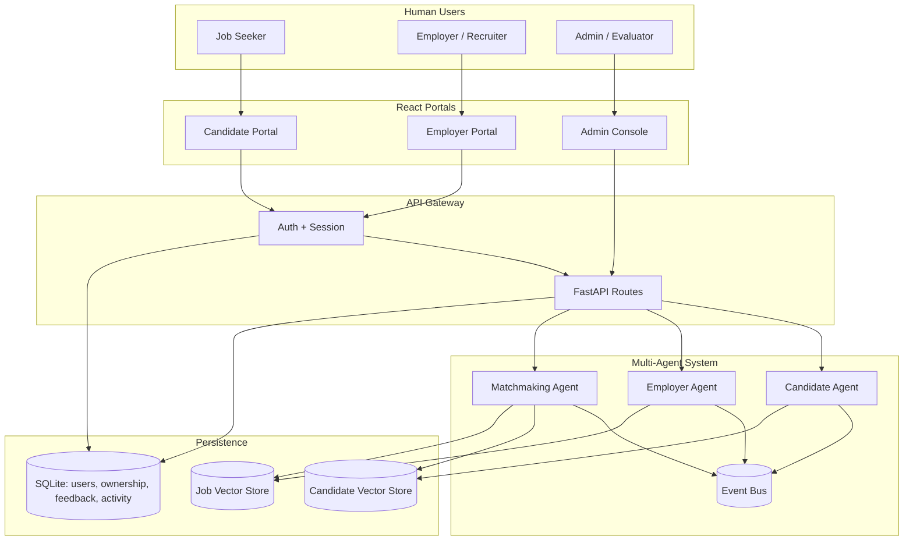
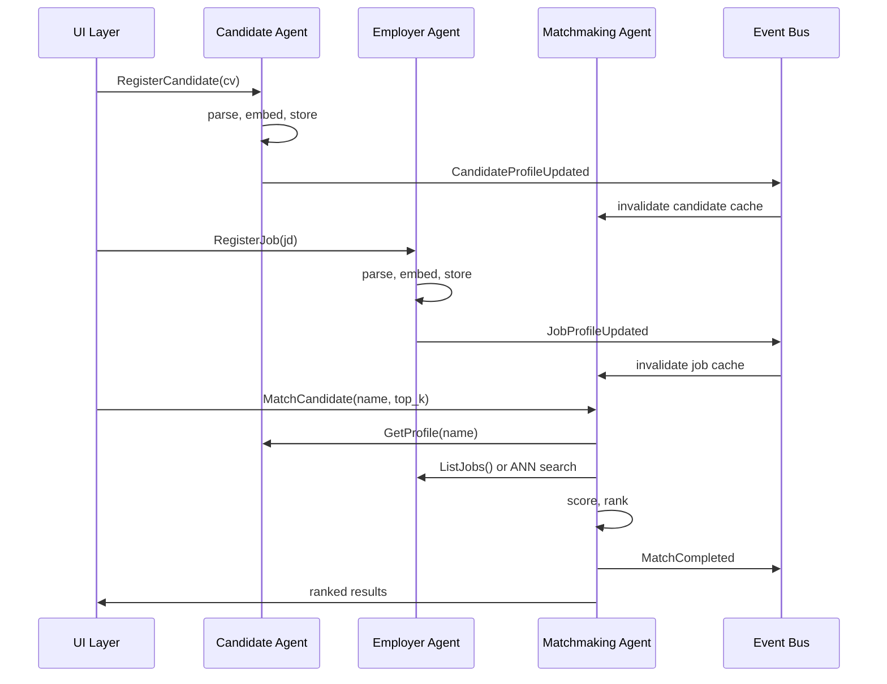

# High-Level Design (HLD)
## Multi-Agent Job Matching System

**Version:** 1.1  
**Date:** 2026-05-27  
**Status:** Implemented · `main` @ `9d1de25` · see [SDD-multi-agent-system.md](./SDD-multi-agent-system.md)  
**Authors:** Harsh Kashyap, Taranumpreet Kaur Wasu  

---

## 1. Executive summary

This document defines the high-level architecture for the **Agentic Job Matching** system. The legacy monolithic FastAPI service (`app.py`) has been replaced by a **multi-agent recruitment platform** with three collaborating agents:

1. **Candidate Agent** · owns resume/CV lifecycle, candidate embeddings, and profile state  
2. **Employer Agent** · owns job description lifecycle, job embeddings, and posting state  
3. **Matchmaking Agent** · reads from both sides, performs composite/semantic matching, produces ranked recommendations with explanations  

Agents communicate through an **in-process event bus** (event-driven monolith). Each agent maintains **explicit state** and **data ownership**. A **FastAPI gateway** exposes REST APIs; a **React portal** provides role-based UX for candidates, employers, and admins.

**Also shipped beyond the original HLD v1.0 scope:** session auth with SQLite ownership links, LLM resume/JD parsing (Ollama/OpenAI), composite five-signal scoring, role portals, feedback/activity persistence, similar-entity discovery, offline research evaluation pipeline, and demo seed on startup.

---

## 2. Background and motivation

### 2.1 Problem (paper narrative)

- Job seekers face opaque, keyword-driven filters that miss qualified matches.  
- Recruiters spend disproportionate time screening candidates who do not fit.  
- Current systems treat matching as a single search box, not a **collaboration between candidate-side and employer-side intelligence**.

### 2.2 Vision (Sal Khan framing)

Two autonomous representatives · one advocating for the candidate, one for the employer · should **collaborate through a shared matchmaking layer** rather than forcing humans through manual keyword search.

### 2.3 Architecture outcome (implemented)

| Legacy (API monolith) | Current (multi-agent) |
|------------------------|------------------------|
| `app.py` owns everything | Each agent owns a domain |
| Shared `resumes[]`, `jobs[]` arrays | Agent-local state + vector collections |
| Match = function call over globals | Match = orchestrated cross-agent workflow via gateway |
| Single UI | Role portals: candidate, employer, admin |
| No auth | Session auth + SQLite ownership links |

---

## 3. Goals and non-goals

### 3.1 Goals (v1 · shipped)

- Three agents with **clear boundaries**, **owned state**, and **documented communication**  
- Full workflow: ingest CV/JD (JSON + LLM upload) → match → rank → role portals  
- **Reproducible evaluation** on 30/15/47 graded corpus + offline research pipeline  
- **LLM hooks** for resume/JD parsing and grounded explanations (with rule fallback)  
- Paper §3 architecture diagram and agent communication narrative  

### 3.2 Non-goals (deferred)

- Microservices / separate deployable services per agent  
- Redis or external message broker (in-process bus only)  
- Real-time external job board sync  
- Autonomous agent policy selection without user trigger  

### 3.3 Implementation status (2026-05-27)

| Layer | Status | Notes |
|-------|--------|-------|
| Three agents + event bus | Shipped | `backend/agents/`, `backend/bus/` |
| Composite matching | Shipped | Default product strategy; semantic 28%, skills 27%, title 10%, experience 15%, compensation 10%, remote 10% |
| Auth + ownership | Shipped | Cookie sessions; candidate/job links in SQLite |
| Candidate portal | Shipped | Onboarding, profile, matches, saved |
| Employer portal | Shipped | Jobs CRUD, JD import, candidate matches, applications |
| Admin console | Shipped | Agent status, match controls, fairness report |
| LLM parsing | Shipped | Resume + JD via Ollama/OpenAI; manual fallback |
| Research pipeline | Shipped | `run_research_pipeline.py` · 9-stage offline eval |
| Demo seed | Shipped | `demo_seed.py` on startup (`SEED_DEMO=true`) |

---

## 4. System context



**External actors:** job seeker, employer/recruiter, admin/evaluator.  
**System boundary:** role portals + gateway + three agents + vector stores + SQLite.  
**Outside scope:** external job boards, email notifications, production SSO.

---

## 5. Agent definitions

### 5.1 Candidate Agent

**Role:** Representative of the job seeker. Owns everything about candidate profiles.

| Aspect | Detail |
|--------|--------|
| **Inputs** | Structured CV JSON, resume upload (PDF/DOCX/TXT via LLM parser) |
| **Outputs** | `CandidateProfile` state, embedding in candidate vector store |
| **Owns** | Resume parsing (JsonParser at bootstrap; LlmParser on HTTP upload), candidate embeddings collection, candidate profile registry |
| **Does not own** | Job data, matching scores, employer state |

**Core responsibilities:**
1. Accept and validate candidate documents  
2. Normalize skills (catalog aliases)  
3. Generate document text representation  
4. Compute and store candidate embedding  
5. Publish `CandidateProfileUpdated` event  
6. Answer queries: list profiles, get profile by id/name, export snapshot for matchmaker  

**State maintained:**
```text
CandidateAgentState {
  profiles: Map<candidate_id, CandidateProfile>
  store_version: int
  last_updated: timestamp
}
```

**LLM hook (shipped):** unstructured CV → structured `CandidateProfile` via `LlmParser` (Ollama/OpenAI); manual form fallback when LLM unavailable.

---

### 5.2 Employer Agent

**Role:** Representative of the hiring organization. Owns everything about job postings.

| Aspect | Detail |
|--------|--------|
| **Inputs** | Structured job JSON, JD paste/upload (LLM parser) |
| **Outputs** | `JobProfile` state, embedding in job vector store |
| **Owns** | JD parsing (JsonParser at bootstrap; LlmParser on HTTP upload), job embeddings collection, job registry |
| **Does not own** | Candidate data, final match rankings |

**Core responsibilities:**
1. Accept and validate job descriptions  
2. Normalize required skills  
3. Generate document text representation  
4. Compute and store job embedding  
5. Publish `JobProfileUpdated` event  
6. Answer queries: list jobs, get job by id/title, export snapshot for matchmaker  

**State maintained:**
```text
EmployerAgentState {
  jobs: Map<job_id, JobProfile>
  store_version: int
  last_updated: timestamp
}
```

**LLM hook (shipped):** unstructured JD → structured `JobProfile` via `LlmParser`; job lifecycle fields (`status`, `apply_url`) on owned postings.

---

### 5.3 Matchmaking Agent

**Role:** Neutral broker. Reads **published representations** from both agents and produces matches.

| Aspect | Detail |
|--------|--------|
| **Inputs** | Match requests (candidate→jobs or job→candidates), strategy config |
| **Outputs** | Ranked match lists, composite/semantic scores, rule-based explanations (optional LLM) |
| **Owns** | Matching strategies, ranking logic, optional cross-encoder rerank, match session history |
| **Does not own** | Raw CVs, raw JDs, vector store writes |

**Core responsibilities:**
1. Subscribe to `CandidateProfileUpdated` and `JobProfileUpdated` (invalidate caches)  
2. Query candidate and employer agents for current snapshots / ANN search  
3. Run semantic, multimodal, or **composite** scoring (product default)  
4. Apply ranking (top-K, optional RRF ensemble, optional cross-encoder rerank)  
5. Publish `MatchCompleted` event  
6. Expose match API to UI; employer direction may include candidate contact fields

**State maintained:**
```text
MatchmakerAgentState {
  index_fingerprint: { candidate_version, job_version }
  last_match_runs: RingBuffer<MatchSession>
  default_strategy: StrategyConfig
}
```

**LLM hook (shipped):** optional `GroundedLlmExplainer` when `explain_mode=llm`; rule fallback always available.

---

## 6. Agent communication model

### 6.1 Pattern: event-driven monolith

All agents run in **one Python process**. Communication uses:

1. **Commands** · UI or orchestrator asks an agent to do work (synchronous request/response)  
2. **Events** · agent publishes facts; other agents subscribe (async, in-process)

This gives a credible **multi-agent story** without operational overhead of microservices.

### 6.2 Event catalog (v1)

| Event | Publisher | Subscribers | Payload |
|-------|-----------|-------------|---------|
| `CandidateProfileUpdated` | Candidate Agent | Matchmaker | `{ candidate_id, version }` |
| `JobProfileUpdated` | Employer Agent | Matchmaker | `{ job_id, version }` |
| `CorpusBootstrapped` | System bootstrap | All agents | `{ candidate_count, job_count }` |
| `MatchCompleted` | Matchmaker | UI (optional log) | `{ session_id, query_type, top_k }` |
| `MatchRequested` | UI / API gateway | Matchmaker | `{ query, strategy, top_k }` |

### 6.3 Shared data contract

Agents **do not read each other's private state directly**. The matchmaker receives:

- **Candidate snapshot:** `{ id, name, skills[], embedding_ref | vector, document_text_hash, version }`  
- **Job snapshot:** `{ id, title, required_skills[], embedding_ref | vector, document_text_hash, version }`

Snapshots are **immutable for a given version**. Updates bump version and emit events.

### 6.4 Communication diagram



---

## 7. High-level workflows

### 7.1 System bootstrap

```text
1. Start event bus
2. Initialize Candidate Agent → load cvs.json → embed → populate candidate store
3. Initialize Employer Agent → load jobs.json → embed → populate job store
4. Initialize Matchmaker Agent → subscribe to events → record corpus versions
5. Start API gateway + UI
6. Emit CorpusBootstrapped
```

### 7.2 Candidate → jobs match

```text
1. User selects candidate in UI
2. UI sends MatchCandidate request to Matchmaker
3. Matchmaker fetches candidate snapshot from Candidate Agent
4. Matchmaker retrieves job candidates:
   v1 exhaustive: all job snapshots from Employer Agent
   v1.1 ANN: query job vector store via Employer Agent search API
5. Matchmaker scores each pair (semantic / multimodal)
6. Matchmaker ranks and returns top-K with scores
7. UI renders results + rule-based explanations
```

### 7.3 Job → candidates match

Same flow with direction reversed.

### 7.4 Batch daily recommendations (agentic workflow)

```text
1. UI triggers DailyRecommendationsRun
2. Matchmaker iterates all candidate profiles (from Candidate Agent)
3. For each: ANN shortlist from Employer Agent → score → top-K
4. Write dated JSON artifact (preserved for paper/demo)
5. Emit MatchCompleted per batch
```

---

## 8. Matching pipeline (high level)

Algorithm presented in paper §3 / §4; implementation detail deferred to SDD.

```text
INPUT:  candidate_profile C, job corpus J, strategy S, metric M, top_k K

1. PREPROCESS
   - canonicalize skills (both sides)
   - build document text (fixed field templates)

2. EMBED (owned by respective agents at ingest time)
   - e_C = Embed(resume_text)
   - e_J = Embed(job_text)  for each job

3. RETRIEVE (matchmaker)
   - exhaustive: all jobs in J
   - ANN: TopPool(J, e_C, pool_size)

4. SCORE (matchmaker · `score_pair_advanced`)
   - strategies: semantic | multimodal | **composite** (product default)
   - composite: semantic 28%, skills 27%, title 10%, experience 15%, compensation 10%, remote 10%
   - optional: learned fusion, constraints, feedback boost, Platt calibration
   - optional: cross-encoder rerank (top pool)

5. RANK
   - sort descending by final score
   - assign ranks 1..n

6. OUTPUT
   - top-K list with semantic_score, skills_score, similarity, rank
   - optional why_ranked bullets (rule-based v1)

OUTPUT: MatchResult[]
```

**Preserved from legacy system (as libraries, not copy-paste):**
- Graded eval labels and metrics formulas  
- Document template field order (for benchmark reproducibility)  
- Soft embed @ w=0.7 as best-known strategy (benchmark config)

---

## 9. UI / application layer

The UI is **not an agent**. It is the **demonstration surface** where humans trigger agent workflows through **role-scoped portals**.

### 9.1 Portal routes (React + Vite)

| Portal | Routes | Primary flows |
|--------|--------|---------------|
| **Auth** | `/login`, `/register` | Session login; demo accounts; role picker on register |
| **Candidate** | `/candidate/onboarding`, `/profile`, `/matches`, `/saved` | Resume upload → review → PUT upsert → job search; profile edit; saved/applied |
| **Employer** | `/employer/jobs`, `/matches`, `/applications` | JD paste/upload → post role → candidate match → applications feed |
| **Admin** | `/admin/console` | Agent status, ad-hoc match, ensemble, daily batch, fairness, vector store switch |
| **Errors** | `/error/{401,402,403,501,502}` | Branded error pages via `ApiErrorBridge` |

**Layout:** `PortalShell` (top nav, theme toggle, mobile tabs) wraps candidate/employer/admin layouts. Theme via `tokens.css` + `dark-mode.css`; portal accent via `data-portal` on `<html>`.

### 9.2 UI → backend routing

| UI capability | Routed to |
|---------------|-----------|
| Onboarding / profile save | `PUT /candidates/me` → Candidate Agent + ownership link |
| Resume upload | `POST /candidates/upload-resume` → LLM parser + form prefill |
| Find jobs (candidate) | `POST /match/candidate-to-jobs` → Matchmaking Agent (`strategy: composite` default) |
| Post / edit job | `POST /jobs`, `PUT /jobs/mine/{id}` → Employer Agent + ownership |
| JD import | `POST /jobs/parse-description`, `POST /jobs/upload-description` |
| Find candidates | `POST /match/job-to-candidates` |
| Save / apply / feedback | `POST /feedback/actions` → FeedbackStore + activity sync |
| Agent observability | `GET /agents/status`, `GET /agents/events/recent` |
| Fairness / system | `GET /system/fairness`, `GET /system/config`, `POST /system/vector-store` |

### 9.3 Profile gating (candidate portal)

| State | Detection | UI behavior |
|-------|-----------|-------------|
| No profile | `GET /candidates/me` → 404 `NOT_FOUND` | `ProfileNeededEmpty` → onboarding |
| Stale profile | 404 `PROFILE_NOT_FOUND` (link kept, in-memory profile gone) | `ProfileStaleEmpty` → re-save form |
| Incomplete | Profile exists but missing `id` + `name` | `ProfileIncompleteEmpty` → finish profile |
| Ready | `isCandidateProfileReady` | Jobs search enabled; auto-search after onboarding save |

**New UI elements (shipped):** Agent status panel, match details drawer with score breakdown, resume coach, similar jobs/candidates, empty-state variants per backend state, loading states on refresh actions.

---

## 10. Technology choices (high level)

| Layer | Choice | Rationale |
|-------|--------|-----------|
| Language | Python 3.11+ | Benchmarks, ML ecosystem |
| Agent runtime | Single process, sync handlers | Demo reliability; upgrade path to Redis |
| Event bus | In-process pub-sub (`AgentEventBus`) | No external broker ops |
| API gateway | FastAPI on port **8001** | Thin routes; session middleware |
| Auth | Starlette sessions + SQLite `UserStore` | Role portals; ownership links |
| Embeddings | sentence-transformers / MiniLM | Proven in eval |
| Vector store | Chroma default, Qdrant optional | Hot-switch via `bootstrap_reindex.py` |
| Frontend | React 19 + Vite on port **5173** | Role portals, theme tokens |
| Schemas | Pydantic v2 | Agent message validation |
| Tests | pytest + node unit tests | 200+ integration/unit; 38 benchmark tests |

---

## 11. Logical deployment view

```text
┌─────────────────────────────────────────────────────────────────┐
│                     Python Process                               │
│  ┌─────────────┐  ┌─────────────┐  ┌─────────────────────┐      │
│  │  Candidate  │  │  Employer   │  │    Matchmaking      │      │
│  │    Agent    │  │    Agent    │  │       Agent         │      │
│  └──────┬──────┘  └──────┬──────┘  └──────────┬──────────┘      │
│         └────────────────┼─────────────────────┘                │
│                          ▼                                      │
│                   Agent Event Bus                               │
│         ┌────────────────┴────────────────┐                   │
│         ▼                                 ▼                   │
│  candidates_collection            jobs_collection              │
│  (Chroma / Qdrant)                (Chroma / Qdrant)            │
│                                                                 │
│  ┌──────────────────────────────────────────────────────────┐  │
│  │ SQLite (app.db): users, candidate_ownership, job_ownership│  │
│  │                  user_feedback, match_feedback, activity  │  │
│  └──────────────────────────────────────────────────────────┘  │
│                          ▲                                      │
│                   FastAPI Gateway + Auth                        │
└─────────────────────────────────────────────────────────────────┘
                          ▲
                          │ HTTP :8001 (cookie session)
                   ┌──────┴──────┐
                   │ React UI    │  :5173 · candidate / employer / admin
                   └─────────────┘
```

**Upgrade path:** any agent can be extracted to its own service by replacing in-process bus with Redis/NATS and keeping the same event schema.

---

## 12. Mapping from legacy monolith

| Legacy module | New owner |
|---------------|-----------|
| `data/cvs.json` load + resume embed | Candidate Agent |
| `data/jobs.json` load + job embed | Employer Agent |
| `ingestion.py` | Split across both agents |
| `matching/*` scoring | Matchmaking Agent (via `core/matching` lib) |
| `stores/*` | Shared infra; **collections partitioned** by agent |
| `app.py` match routes | Matchmaker + thin API gateway |
| `app.py` catalog routes | Respective agents |
| `real_jobs_sync.py` | Employer Agent (v2) |
| `benchmarks/*` | External eval harness calling agent APIs or direct matchmaker |

---

## 13. LLM and ML extensions (shipped)

| Hook | Agent / layer | Behavior |
|------|---------------|----------|
| `parse_cv` | Gateway + `LlmParser` | Resume PDF/DOCX/TXT → structured fields; CID cleanup; contact regex fallback |
| `parse_jd` | Gateway + `LlmParser` | JD file or pasted text → job form fields |
| `explain_match` | Matchmaker | Rule-based bullets default; optional `GroundedLlmExplainer` |
| `resume_suggestions` | Gateway | ATS gap analysis for candidate vs job |
| `strategy_select` | Matchmaker | `strategy_router.py` auto-picks strategy from profile shape |
| `composite` scoring | Matchmaker | Five-signal blend (semantic, skills, experience, compensation, location) |
| `cross_encoder_rerank` | Matchmaker | Optional second stage (off by default; eval shows nDCG cost) |
| `learned_fusion` / `calibration` | Matchmaker | Optional models from `data/models/` |

Bootstrap corpus parsing uses `JsonParser`; HTTP upload paths use `LlmParser` with unavailable fallback to manual form entry.

---

## 14. Evaluation and success criteria

### 14.1 Preserved benchmarks

- `paper_progression` must reproduce Table 9 ladder (within float tolerance)  
- `phase11` must reproduce 40-config ANN sweep  
- `eval_pairs.json` unchanged  

### 14.2 New agent-level acceptance criteria

| Criterion | Measure |
|-----------|---------|
| Agent isolation | Matchmaker tests pass with mocked agent interfaces |
| Event propagation | Profile update event invalidates matchmaker cache |
| End-to-end | UI match flow works without direct store access from UI |
| Observability | Agent status API returns version + counts for all three |
| Paper alignment | §3 block diagram maps 1:1 to implemented agents |

---

## 15. Risks and mitigations

| Risk | Impact | Mitigation |
|------|--------|------------|
| "Agents" are only naming | Paper rejected as rebrand | Enforce event bus + state ownership in code reviews |
| Benchmark regression | Lost research results | Run progression before/after rewrite; gate on metrics |
| Over-engineering | Delayed delivery | v1 in-process only; no Redis/microservices |
| LLM scope creep | Blocked v1 | Explicit NoOp adapters; interfaces only |
| Dual vector stores complexity | Bugs in sync | Single factory; agents call shared store adapter |

---

## 16. Implementation phases (completed)

| Phase | Deliverable | Status |
|-------|-------------|--------|
| **Phase 0** | HLD approval | Done |
| **Phase 1** | SDD | Done |
| **Phase 2** | Core agents + event bus + bootstrap | Done |
| **Phase 3** | Matchmaker + scoring + eval harness | Done |
| **Phase 4** | API gateway + role portals + auth | Done |
| **Phase 5** | Benchmark + research pipeline parity | Done |
| **Phase 6** | Paper artifacts + demo polish | In progress |

**Next:** scale research eval (100×50 corpus), supervisor diagram approval, optional microservice extraction.

---

## 19. Authentication and ownership (product layer)

Not part of the three-agent core, but required for role portals:

| Concept | Implementation |
|---------|----------------|
| Sessions | Cookie `jm_session` via Starlette middleware |
| Roles | `candidate`, `employer`, `admin` |
| Candidate link | 1:1 `candidate_ownership(user_id → candidate_id)` |
| Job link | 1:1 `job_ownership(job_id → user_id)`; `link_job_if_unowned` on POST |
| Access control | `require_role()` on mutating routes; employer checks `list_job_ids` |
| Stale recovery | Ownership link retained when in-memory profile missing; PUT recreates profile |
| Cross-tenant guard | POST `/jobs` with another user's `job_id` → 403 `JOB_NOT_OWNED` |
| Demo seed | `demo_seed.py` links demo accounts to corpus IDs on startup |

---

## 20. Extended services (beyond three agents)

| Service | Purpose |
|---------|---------|
| **FeedbackStore** | UI feedback (save, apply, reject, contact); legacy pair feedback for research |
| **CandidateActivityStore** | Saved jobs and application records |
| **Similar entities** | `/similar/jobs`, `/similar/candidates` via embedding + skills |
| **ReadOnlyMiddleware** | Demo mode blocks mutations except auth |
| **Research pipeline** | Offline 9-stage eval → `backend/reports/research_run_*/` |
| **Fairness audit** | `GET /system/fairness` exposes eval report |

---

## 21. Open decisions (remaining)

1. Single shared Chroma client vs two logical collections · **recommend:** two collections, one factory  
2. Matchmaker exhaustive vs ANN default for UI · **recommend:** exhaustive v1 (15 jobs), ANN for batch  
3. Whether Candidate and Employer agents expose ANN search or only Matchmaker queries stores · **recommend:** agents expose `search_jobs` / `search_candidates` as their API  
4. Agent ID naming in paper: "Candidate/Client" vs "Employee" · **recommend:** Candidate Agent (paper) / Client Agent (UI label alias)  

---

## 22. Approval

| Reviewer | Role | Approved | Date |
|----------|------|----------|------|
| Harsh Kashyap | Author | ☐ | |
| Taranumpreet Kaur Wasu | Author | ☐ | |
| Dr Parteek Bhatia | Supervisor | ☐ | |

**Next step:** align paper §3 diagram with implemented portals and composite scoring; run 100×50 research pipeline eval.

---

## Appendix B · Narrative source: *Brave New Words* Part VIII

See **Paper rewrite roadmap §2b** for full mapping. Part VIII covers:
- **K‑12 assessments:** continuous mastery-based assessment vs one-shot exams; AI tutors enabling ongoing measurement
- **College admissions:** holistic, data-informed review; AI triage + human judgment; growth curves over single test days
- **Risks:** bias, opacity, homogenized AI-written essays; requires transparency and equity guardrails

Our system translates the **admissions** half into **job matching**: candidate agent + employer agent + matchmaking broker, with human-in-the-loop and published evaluation metrics.

---

## Appendix A · Professor three-agent checklist

- [x] Candidate/client-side agent with CV input, parsing, embedding, vector store, profile state  
- [x] Employer-side agent with JD input, parsing, embedding, vector store, job state  
- [x] Matchmaking agent reading both stores, semantic search, scoring, ranked output  
- [x] UI/application layer demonstrating workflow  
- [x] Agent communication and state sharing documented  
- [x] Matching algorithm outlined (detail in SDD + paper)  
- [x] Technical details deferred to Implementation section of paper (SDD maps to this)
