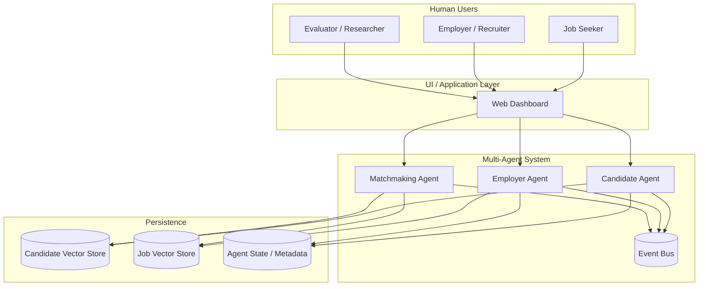
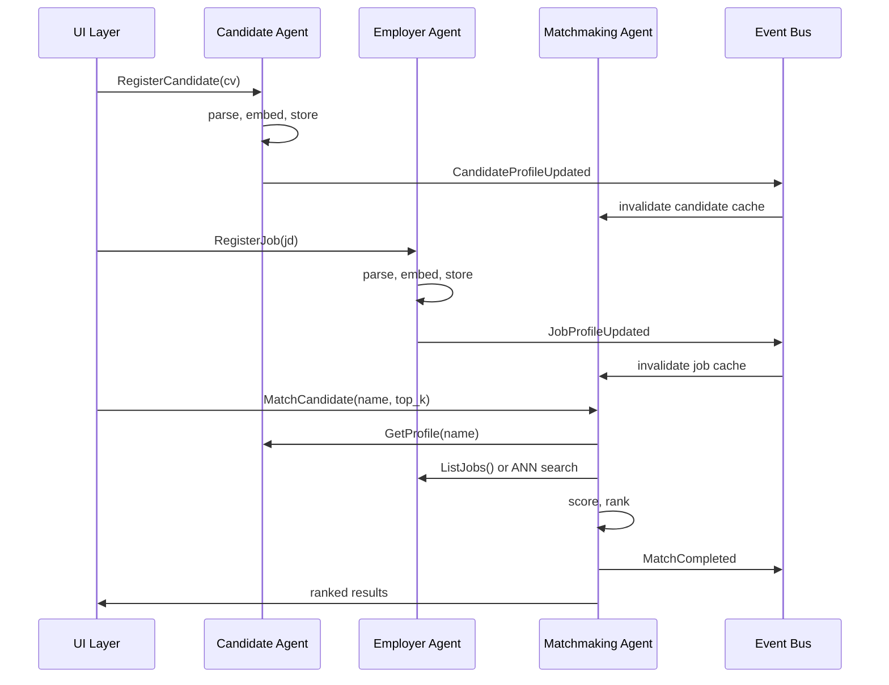

# High-Level Design (HLD)
## Multi-Agent Job Matching System

**Version:** 1.0  
**Date:** 2026-05-27  
**Status:** Approved for SDD — see [SDD-multi-agent-system.md](./SDD-multi-agent-system.md)  
**Authors:** Harsh Kashyap, Taranumpreet Kaur Wasu  

---

## 1. Executive summary

This document defines the high-level architecture for a **greenfield rewrite** of the Agentic Job Matching system. The current implementation is a **monolithic FastAPI service** with 14 REST endpoints and shared global state. The target is a **multi-agent recruitment system** with three collaborating agents:

1. **Candidate Agent** — owns resume/CV lifecycle and candidate representations  
2. **Employer Agent** — owns job description lifecycle and job representations  
3. **Matchmaking Agent** — reads from both sides, performs semantic matching, produces ranked recommendations  

Agents communicate through an **in-process event bus** (event-driven monolith). Each agent maintains **explicit state** and **data ownership**. An **LLM layer** is reserved for future parsing and explanation but is **not required for v1**.

The **evaluation corpus** (`cvs.json`, `jobs.json`, `eval_pairs.json`) and **benchmark drivers** (`paper_progression`, `phase11`) are preserved. All other application code is rewritten.

---

## 2. Background and motivation

### 2.1 Problem (paper narrative)

- Job seekers face opaque, keyword-driven filters that miss qualified matches.  
- Recruiters spend disproportionate time screening candidates who do not fit.  
- Current systems treat matching as a single search box, not a **collaboration between candidate-side and employer-side intelligence**.

### 2.2 Vision (Sal Khan framing)

Two autonomous representatives — one advocating for the candidate, one for the employer — should **collaborate through a shared matchmaking layer** rather than forcing humans through manual keyword search.

### 2.3 Why move from API monolith to agents

| Current (API monolith) | Target (multi-agent) |
|------------------------|----------------------|
| `app.py` owns everything | Each agent owns a domain |
| Shared `resumes[]`, `jobs[]` arrays | Agent-local state + published snapshots |
| Match = function call over globals | Match = orchestrated cross-agent workflow |
| "Agentic" = batch HTTP endpoints | Agentic = stateful agents + events + roles |
| Hard to explain in paper §3 | Maps directly to professor's three-agent diagram |

---

## 3. Goals and non-goals

### 3.1 Goals (v1)

- Implement three agents with **clear boundaries**, **owned state**, and **documented communication**.  
- Support full workflow: ingest CV → ingest JD → match → rank → display in UI.  
- Preserve **reproducible evaluation** on existing 30/15/47 graded corpus.  
- Design **LLM hook points** without requiring LLM in v1.  
- Enable paper §3 architecture diagram and §3.4 agent communication narrative.

### 3.2 Non-goals (v1)

- Microservices / separate deployable services  
- Redis or external message broker (in-process bus only)  
- LLM-powered parsing or reranking (deferred to v2 hooks)  
- Real-time external job API sync (can re-add after core agents work)  
- Autonomous agent policy selection (user/UI still triggers workflows)

---

## 4. System context



**External actors:** job seeker, employer/recruiter, evaluator (benchmark runner).  
**System boundary:** UI + three agents + vector stores + event bus.  
**Outside v1:** LLM provider, external job boards, email notifications.

---

## 5. Agent definitions

### 5.1 Candidate Agent

**Role:** Representative of the job seeker. Owns everything about candidate profiles.

| Aspect | Detail |
|--------|--------|
| **Inputs** | Structured CV JSON, future: raw PDF/text |
| **Outputs** | `CandidateProfile` state, embedding in candidate vector store |
| **Owns** | Resume parsing pipeline (v1: schema validation), candidate embeddings collection, candidate profile registry |
| **Does not own** | Job data, matching scores, employer state |

**Core responsibilities:**
1. Accept and validate candidate documents  
2. Normalize skills (catalog aliases)  
3. Generate document text representation  
4. Compute and store candidate embedding  
5. Publish `CandidateProfileUpdated` event  
6. Answer queries: list profiles, get profile by id/name, export snapshot for matchmaker  

**State maintained:**
```text
CandidateAgentState {
  profiles: Map<candidate_id, CandidateProfile>
  store_version: int
  last_updated: timestamp
}
```

**Future LLM hook:** unstructured CV → structured `CandidateProfile` (parsing agent tool).

---

### 5.2 Employer Agent

**Role:** Representative of the hiring organization. Owns everything about job postings.

| Aspect | Detail |
|--------|--------|
| **Inputs** | Structured job JSON, future: raw JD text, external API feed |
| **Outputs** | `JobProfile` state, embedding in job vector store |
| **Owns** | JD parsing pipeline (v1: schema validation), job embeddings collection, job registry |
| **Does not own** | Candidate data, final match rankings |

**Core responsibilities:**
1. Accept and validate job descriptions  
2. Normalize required skills  
3. Generate document text representation  
4. Compute and store job embedding  
5. Publish `JobProfileUpdated` event  
6. Answer queries: list jobs, get job by id/title, export snapshot for matchmaker  

**State maintained:**
```text
EmployerAgentState {
  jobs: Map<job_id, JobProfile>
  store_version: int
  last_updated: timestamp
}
```

**Future LLM hook:** unstructured JD → structured `JobProfile`; job requirement extraction.

---

### 5.3 Matchmaking Agent

**Role:** Neutral broker. Reads **published representations** from both agents and produces matches.

| Aspect | Detail |
|--------|--------|
| **Inputs** | Match requests (candidate→jobs or job→candidates), strategy config |
| **Outputs** | Ranked match lists, scores, explanations (rule-based v1) |
| **Owns** | Matching strategies, ranking logic, match session history |
| **Does not own** | Raw CVs, raw JDs, vector store writes |

**Core responsibilities:**
1. Subscribe to `CandidateProfileUpdated` and `JobProfileUpdated` (invalidate caches)  
2. Query candidate and employer agents for current snapshots / ANN search  
3. Run semantic and multimodal scoring  
4. Apply ranking (top-K, optional RRF ensemble)  
5. Publish `MatchCompleted` event  
6. Expose match API to UI  

**State maintained:**
```text
MatchmakerAgentState {
  index_fingerprint: { candidate_version, job_version }
  last_match_runs: RingBuffer<MatchSession>
  default_strategy: StrategyConfig
}
```

**Future LLM hook:** natural-language match explanations; query refinement.

---

## 6. Agent communication model

### 6.1 Pattern: event-driven monolith

All agents run in **one Python process**. Communication uses:

1. **Commands** — UI or orchestrator asks an agent to do work (synchronous request/response)  
2. **Events** — agent publishes facts; other agents subscribe (async, in-process)

This gives a credible **multi-agent story** without operational overhead of microservices.

### 6.2 Event catalog (v1)

| Event | Publisher | Subscribers | Payload |
|-------|-----------|-------------|---------|
| `CandidateProfileUpdated` | Candidate Agent | Matchmaker | `{ candidate_id, version }` |
| `JobProfileUpdated` | Employer Agent | Matchmaker | `{ job_id, version }` |
| `CorpusBootstrapped` | System bootstrap | All agents | `{ candidate_count, job_count }` |
| `MatchCompleted` | Matchmaker | UI (optional log) | `{ session_id, query_type, top_k }` |
| `MatchRequested` | UI / API gateway | Matchmaker | `{ query, strategy, top_k }` |

### 6.3 Shared data contract

Agents **do not read each other's private state directly**. The matchmaker receives:

- **Candidate snapshot:** `{ id, name, skills[], embedding_ref | vector, document_text_hash, version }`  
- **Job snapshot:** `{ id, title, required_skills[], embedding_ref | vector, document_text_hash, version }`

Snapshots are **immutable for a given version**. Updates bump version and emit events.

### 6.4 Communication diagram



---

## 7. High-level workflows

### 7.1 System bootstrap

```text
1. Start event bus
2. Initialize Candidate Agent → load cvs.json → embed → populate candidate store
3. Initialize Employer Agent → load jobs.json → embed → populate job store
4. Initialize Matchmaker Agent → subscribe to events → record corpus versions
5. Start API gateway + UI
6. Emit CorpusBootstrapped
```

### 7.2 Candidate → jobs match

```text
1. User selects candidate in UI
2. UI sends MatchCandidate request to Matchmaker
3. Matchmaker fetches candidate snapshot from Candidate Agent
4. Matchmaker retrieves job candidates:
   v1 exhaustive: all job snapshots from Employer Agent
   v1.1 ANN: query job vector store via Employer Agent search API
5. Matchmaker scores each pair (semantic / multimodal)
6. Matchmaker ranks and returns top-K with scores
7. UI renders results + rule-based explanations
```

### 7.3 Job → candidates match

Same flow with direction reversed.

### 7.4 Batch daily recommendations (agentic workflow)

```text
1. UI triggers DailyRecommendationsRun
2. Matchmaker iterates all candidate profiles (from Candidate Agent)
3. For each: ANN shortlist from Employer Agent → score → top-K
4. Write dated JSON artifact (preserved for paper/demo)
5. Emit MatchCompleted per batch
```

---

## 8. Matching pipeline (high level)

Algorithm presented in paper §3 / §4; implementation detail deferred to SDD.

```text
INPUT:  candidate_profile C, job corpus J, strategy S, metric M, top_k K

1. PREPROCESS
   - canonicalize skills (both sides)
   - build document text (fixed field templates)

2. EMBED (owned by respective agents at ingest time)
   - e_C = Embed(resume_text)
   - e_J = Embed(job_text)  for each job

3. RETRIEVE (matchmaker)
   - exhaustive: all jobs in J
   - ANN: TopPool(J, e_C, pool_size)

4. SCORE (matchmaker)
   - semantic: sim(e_C, e_J, M)
   - multimodal: w * semantic + (1-w) * skills_overlap(C, J)
   - skills_overlap: Jaccard (v1 default) or soft embed (benchmark mode)

5. RANK
   - sort descending by final score
   - assign ranks 1..n

6. OUTPUT
   - top-K list with semantic_score, skills_score, similarity, rank
   - optional why_ranked bullets (rule-based v1)

OUTPUT: MatchResult[]
```

**Preserved from legacy system (as libraries, not copy-paste):**
- Graded eval labels and metrics formulas  
- Document template field order (for benchmark reproducibility)  
- Soft embed @ w=0.7 as best-known strategy (benchmark config)

---

## 9. UI / application layer

The UI is **not an agent**. It is the **demonstration surface** where humans trigger agent workflows.

| UI capability | Routed to |
|---------------|-----------|
| Select candidate / job | read-only queries to respective agents |
| Run match | Matchmaker |
| Toggle strategy / metric | Matchmaker config |
| Ensemble match | Matchmaker (multi-strategy + RRF) |
| View agent status | all agents (health + corpus counts + store versions) |
| Run daily batch | Matchmaker orchestration |
| Switch vector backend | shared infra config (both stores) |

**New UI element (v1):** Agent status panel showing each agent's state version and last event — makes agentic framing visible to demo audience.

---

## 10. Technology choices (high level)

| Layer | Choice | Rationale |
|-------|--------|-----------|
| Language | Python 3.11+ | Existing benchmarks, ML ecosystem |
| Agent runtime | Single process, asyncio-compatible sync v1 | Simplicity, demo reliability |
| Event bus | In-process pub-sub (`AgentEventBus` class) | No Redis ops; upgrade path to Redis later |
| API gateway | FastAPI (thin) | Routes to agents; no business logic |
| Embeddings | sentence-transformers / MiniLM | Proven in current eval |
| Vector store | Chroma default, Qdrant optional | Preserved benchmark parity |
| Frontend | React + Vite | Existing stack familiarity |
| Schemas | Pydantic v2 | Agent message validation |
| Tests | pytest | 63-test parity target on eval + agent contracts |

---

## 11. Logical deployment view

```text
┌─────────────────────────────────────────────────────────────┐
│                     Python Process (v1)                      │
│  ┌─────────────┐  ┌─────────────┐  ┌─────────────────────┐  │
│  │  Candidate  │  │  Employer   │  │    Matchmaking      │  │
│  │    Agent    │  │    Agent    │  │       Agent         │  │
│  └──────┬──────┘  └──────┬──────┘  └──────────┬──────────┘  │
│         │                │                     │             │
│         └────────────────┼─────────────────────┘             │
│                          ▼                                   │
│                   Agent Event Bus                            │
│                          │                                   │
│         ┌────────────────┴────────────────┐                │
│         ▼                                 ▼                │
│  Candidate Vector Store            Job Vector Store          │
│  (Chroma/Qdrant collection)        (Chroma/Qdrant collection)│
└─────────────────────────────────────────────────────────────┘
                          ▲
                          │ HTTP
                   ┌──────┴──────┐
                   │  React UI   │
                   └─────────────┘
```

**Upgrade path:** any agent can be extracted to its own service by replacing in-process bus with Redis/NATS and keeping the same event schema.

---

## 12. Mapping from legacy monolith

| Legacy module | New owner |
|---------------|-----------|
| `data/cvs.json` load + resume embed | Candidate Agent |
| `data/jobs.json` load + job embed | Employer Agent |
| `ingestion.py` | Split across both agents |
| `matching/*` scoring | Matchmaking Agent (via `core/matching` lib) |
| `stores/*` | Shared infra; **collections partitioned** by agent |
| `app.py` match routes | Matchmaker + thin API gateway |
| `app.py` catalog routes | Respective agents |
| `real_jobs_sync.py` | Employer Agent (v2) |
| `benchmarks/*` | External eval harness calling agent APIs or direct matchmaker |

---

## 13. LLM extension points (hybrid — v2)

| Hook | Agent | v1 behavior | v2 LLM behavior |
|------|-------|-------------|-----------------|
| `parse_cv` | Candidate | Pydantic JSON validate | Extract fields from PDF/text |
| `parse_jd` | Employer | Pydantic JSON validate | Extract requirements from prose |
| `explain_match` | Matchmaker | Rule-based bullets | NL explanation |
| `refine_query` | Matchmaker | N/A | Interpret user intent |
| `strategy_select` | Matchmaker | UI dropdown | Agent picks strategy |

Each hook is an **interface** (`Parser`, `Explainer`) with a **NoOp / rules implementation** in v1.

---

## 14. Evaluation and success criteria

### 14.1 Preserved benchmarks

- `paper_progression` must reproduce Table 9 ladder (within float tolerance)  
- `phase11` must reproduce 40-config ANN sweep  
- `eval_pairs.json` unchanged  

### 14.2 New agent-level acceptance criteria

| Criterion | Measure |
|-----------|---------|
| Agent isolation | Matchmaker tests pass with mocked agent interfaces |
| Event propagation | Profile update event invalidates matchmaker cache |
| End-to-end | UI match flow works without direct store access from UI |
| Observability | Agent status API returns version + counts for all three |
| Paper alignment | §3 block diagram maps 1:1 to implemented agents |

---

## 15. Risks and mitigations

| Risk | Impact | Mitigation |
|------|--------|------------|
| "Agents" are only naming | Paper rejected as rebrand | Enforce event bus + state ownership in code reviews |
| Benchmark regression | Lost research results | Run progression before/after rewrite; gate on metrics |
| Over-engineering | Delayed delivery | v1 in-process only; no Redis/microservices |
| LLM scope creep | Blocked v1 | Explicit NoOp adapters; interfaces only |
| Dual vector stores complexity | Bugs in sync | Single factory; agents call shared store adapter |

---

## 16. Implementation phases

| Phase | Deliverable | Depends on |
|-------|-------------|------------|
| **Phase 0** | HLD approval (this doc) | — |
| **Phase 1** | SDD — classes, interfaces, event schemas, API spec, file layout | HLD approved |
| **Phase 2** | Core agents + event bus + bootstrap | SDD approved |
| **Phase 3** | Matchmaker + scoring lib + eval harness wired | Phase 2 |
| **Phase 4** | API gateway + UI agent panel | Phase 3 |
| **Phase 5** | Benchmark parity verification | Phase 3 |
| **Phase 6** | Paper §3 diagram + algorithm pseudocode | Phase 4 |

**No code until SDD is approved** (per team decision).

---

## 17. Open decisions (for SDD)

1. Single shared Chroma client vs two logical collections — **recommend:** two collections, one factory  
2. Matchmaker exhaustive vs ANN default for UI — **recommend:** exhaustive v1 (15 jobs), ANN for batch  
3. Whether Candidate and Employer agents expose ANN search or only Matchmaker queries stores — **recommend:** agents expose `search_jobs` / `search_candidates` as their API  
4. Agent ID naming in paper: "Candidate/Client" vs "Employee" — **recommend:** Candidate Agent (paper) / Client Agent (UI label alias)  

---

## 18. Approval

| Reviewer | Role | Approved | Date |
|----------|------|----------|------|
| Harsh Kashyap | Author | ☐ | |
| Taranumpreet Kaur Wasu | Author | ☐ | |
| Dr Parteek Bhatia | Supervisor | ☐ | |

**Next step after approval:** produce `SDD-multi-agent-system.md` with class diagrams, interface definitions, event schemas, API endpoints, directory layout, and test plan.

---

## Appendix B — Narrative source: *Brave New Words* Part VIII

See **Paper rewrite roadmap §2b** for full mapping. Part VIII covers:
- **K‑12 assessments:** continuous mastery-based assessment vs one-shot exams; AI tutors enabling ongoing measurement
- **College admissions:** holistic, data-informed review; AI triage + human judgment; growth curves over single test days
- **Risks:** bias, opacity, homogenized AI-written essays; requires transparency and equity guardrails

Our system translates the **admissions** half into **job matching**: candidate agent + employer agent + matchmaking broker, with human-in-the-loop and published evaluation metrics.

---

## Appendix A — Professor three-agent checklist

- [x] Candidate/client-side agent with CV input, parsing, embedding, vector store, profile state  
- [x] Employer-side agent with JD input, parsing, embedding, vector store, job state  
- [x] Matchmaking agent reading both stores, semantic search, scoring, ranked output  
- [x] UI/application layer demonstrating workflow  
- [x] Agent communication and state sharing documented  
- [x] Matching algorithm outlined (detail in SDD + paper)  
- [x] Technical details deferred to Implementation section of paper (SDD maps to this)
