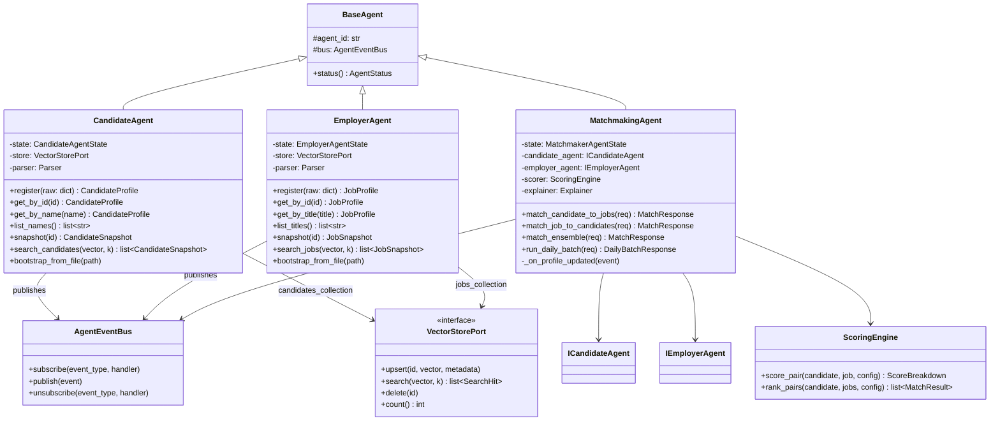
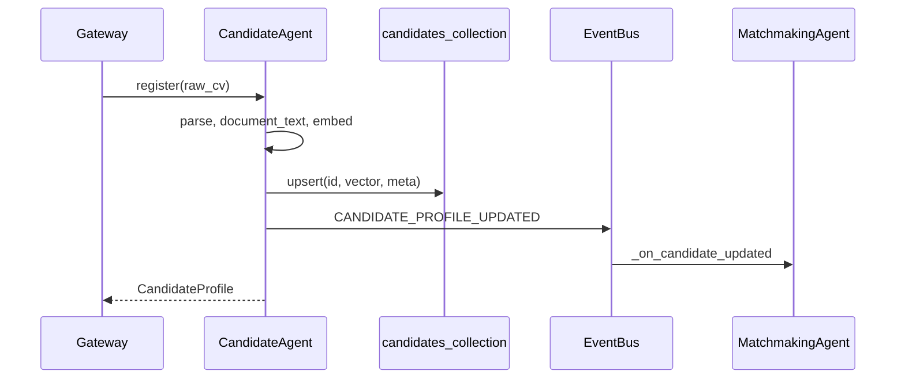
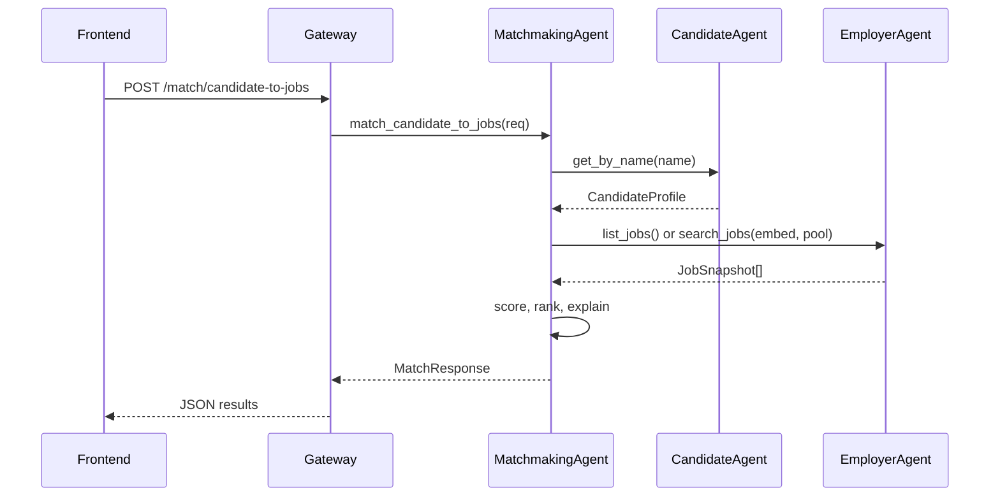

# Software Design Document (SDD)
## Multi-Agent Job Matching System

**Version:** 1.1  
**Date:** 2026-05-27  
**Status:** Implemented · reflects codebase @ `9d1de25`  
**Parent:** [HLD-multi-agent-system.md](./HLD-multi-agent-system.md) v1.1  
**Authors:** Harsh Kashyap, Taranumpreet Kaur Wasu  

---

## 1. Purpose

This SDD specifies the **implemented** multi-agent system: package layout, classes, interfaces, Pydantic schemas, event contracts, REST API, matching algorithm, configuration, bootstrap sequence, role portals, auth/ownership, and test plan.

**Original gate (v1.0):** No application code until SDD approved — **completed**. This v1.1 revision documents as-built behavior including product extensions (auth, LLM parsing, composite scoring, research pipeline).

---

## 2. HLD decisions resolved

| # | HLD open item | SDD decision |
|---|---------------|--------------|
| 1 | Vector store layout | One `VectorStoreFactory`; two collections: `candidates_collection`, `jobs_collection` |
| 2 | UI match retrieval | **Exhaustive** over all jobs/resumes (corpus ≤15 jobs); **ANN** for daily batch (`candidate_pool=120`) |
| 3 | Who exposes ANN search | **Employer Agent** exposes `search_jobs`; **Candidate Agent** exposes `search_candidates`; Matchmaker calls these · never writes to stores |
| 4 | Naming | Code: `CandidateAgent`, `EmployerAgent`, `MatchmakingAgent`; UI label alias "Client" optional |

---

## 3. Repository layout (as-built)

```text
Job-Matching-Agentic/
├── data/
│   ├── cvs.json, jobs.json, eval_pairs.json
│   ├── models/                    # fusion.json, calibration.json (optional)
│   └── research/                  # 100×50 scale corpus (generated)
├── backend/
│   ├── main.py                    # uvicorn entry: create_app()
│   ├── bootstrap.py               # SystemContainer wiring
│   ├── bootstrap_reindex.py       # Chroma ↔ Qdrant hot-switch
│   ├── config.py                  # Settings (Pydantic)
│   ├── demo_seed.py               # Idempotent demo accounts
│   ├── agents/                    # candidate, employer, matchmaking
│   ├── auth/                      # UserStore, routes, deps, passwords
│   ├── bus/                       # AgentEventBus, EventType
│   ├── contracts/                 # profiles, snapshots, matching, interfaces
│   ├── core/                      # scoring, fusion, calibration, constraints,
│   │                              # strategy_router, resume_clean, similar_entities, …
│   ├── hooks/                     # JsonParser, LlmParser, RuleExplainer, GroundedLlmExplainer
│   ├── stores/                    # chroma, qdrant, feedback_store, candidate_activity_store
│   ├── gateway/
│   │   ├── app.py                 # FastAPI + session middleware + demo seed
│   │   ├── middleware.py          # ReadOnlyMiddleware
│   │   └── routes/
│   │       ├── agents.py
│   │       ├── candidates.py      # profile CRUD, upload, saved, applications
│   │       ├── employers.py       # jobs CRUD, JD parse, ownership guard
│   │       ├── matching.py
│   │       ├── similar.py
│   │       ├── feedback.py
│   │       └── system.py
│   ├── benchmarks/                # research_pipeline, comparison, ablation, …
│   ├── scripts/run_research_pipeline.py
│   └── reports/                   # research_run_* artifacts
├── frontend/src/
│   ├── App.jsx                    # Routes + AuthProvider + Toast + ApiErrorBridge
│   ├── api/client.js              # All HTTP calls; DEFAULT_*_MATCH configs
│   ├── context/AuthContext.jsx
│   ├── layouts/                   # PortalShell, Candidate|Employer|Admin, AuthLayout
│   ├── pages/
│   │   ├── Login.jsx, Register.jsx
│   │   ├── candidate/             # Onboarding, Profile, Matches, Saved
│   │   ├── employer/              # Jobs, Matches, Applications
│   │   ├── admin/AdminConsole.jsx
│   │   └── errors/
│   ├── components/                # MatchDetailsDrawer, EmptyState, forms, results, …
│   ├── theme/                     # tokens, dark-mode, polish, auth, ambient
│   └── utils/                     # profileFields, jobFields, validation, profileEvents
└── tests/
    ├── unit/                      # Python + node (.mjs)
    ├── integration/               # API flows, profile, employer jobs
    └── benchmarks/
```

---

## 4. Class diagram



---

## 5. Interface definitions (Protocols)

File: `backend/contracts/interfaces.py`

```python
from typing import Protocol, runtime_checkable
from contracts.snapshots import CandidateSnapshot, JobSnapshot
from contracts.profiles import CandidateProfile, JobProfile
from contracts.matching import MatchRequest, MatchResponse, EnsembleRequest, DailyBatchRequest, DailyBatchResponse
from contracts.agent_status import AgentStatus
import numpy as np


@runtime_checkable
class ICandidateAgent(Protocol):
    agent_id: str

    def register(self, raw: dict) -> CandidateProfile: ...
    def get_by_id(self, candidate_id: str) -> CandidateProfile | None: ...
    def get_by_name(self, name: str) -> CandidateProfile | None: ...
    def list_names(self) -> list[str]: ...
    def list_profiles(self) -> list[CandidateProfile]: ...
    def snapshot(self, candidate_id: str) -> CandidateSnapshot: ...
    def search_candidates(self, query_vector: np.ndarray, k: int) -> list[CandidateSnapshot]: ...
    def status(self) -> AgentStatus: ...


@runtime_checkable
class IEmployerAgent(Protocol):
    agent_id: str

    def register(self, raw: dict) -> JobProfile: ...
    def get_by_id(self, job_id: str) -> JobProfile | None: ...
    def get_by_title(self, title: str) -> JobProfile | None: ...
    def list_titles(self) -> list[str]: ...
    def list_jobs(self) -> list[JobProfile]: ...
    def snapshot(self, job_id: str) -> JobSnapshot: ...
    def search_jobs(self, query_vector: np.ndarray, k: int) -> list[JobSnapshot]: ...
    def status(self) -> AgentStatus: ...


@runtime_checkable
class IMatchmakingAgent(Protocol):
    agent_id: str

    def match_candidate_to_jobs(self, req: MatchRequest) -> MatchResponse: ...
    def match_job_to_candidates(self, req: MatchRequest) -> MatchResponse: ...
    def match_ensemble(self, req: EnsembleRequest) -> MatchResponse: ...
    def run_daily_batch(self, req: DailyBatchRequest) -> DailyBatchResponse: ...
    def status(self) -> AgentStatus: ...


@runtime_checkable
class VectorStorePort(Protocol):
    collection_name: str

    def upsert(self, entity_id: str, vector: np.ndarray, metadata: dict) -> None: ...
    def search(self, query_vector: np.ndarray, k: int) -> list[SearchHit]: ...
    def delete(self, entity_id: str) -> None: ...
    def count(self) -> int: ...


@runtime_checkable
class Parser(Protocol):
    def parse_candidate(self, raw: dict) -> CandidateProfile: ...
    def parse_job(self, raw: dict) -> JobProfile: ...


@runtime_checkable
class Explainer(Protocol):
    def explain(self, candidate: CandidateSnapshot, job: JobSnapshot, scores: ScoreBreakdown) -> list[str]: ...
```

**Rule:** `MatchmakingAgent` depends only on `ICandidateAgent` and `IEmployerAgent`, never on concrete store classes.

---

## 6. Data models (Pydantic v2)

File: `backend/contracts/profiles.py`

```python
class CandidateProfile(BaseModel):
    id: str
    name: str
    skills: list[str]
    experience_years: int
    preferred_salary: int | None = None
    remote_preference: bool = False
    summary: str = ""
    version: int = 1
    document_text: str = ""          # populated at register
    document_text_hash: str = ""     # sha256 hex
    embedding: list[float] | None = None   # 384-d; omitted in API list views


class JobProfile(BaseModel):
    id: str
    title: str
    required_skills: list[str]
    required_experience: int
    budget: int | None = None
    remote_policy: bool = False
    description: str = ""
    company: str | None = None
    location: str | None = None
    job_type: str | None = None
    link: str | None = None
    version: int = 1
    document_text: str = ""
    document_text_hash: str = ""
    embedding: list[float] | None = None
```

File: `backend/contracts/snapshots.py`

```python
class CandidateSnapshot(BaseModel):
    """Immutable view for matchmaker · no private agent internals."""
    id: str
    name: str
    skills: list[str]
    experience_years: int
    remote_preference: bool
    summary: str
    version: int
    document_text_hash: str
    embedding: list[float]           # required for scoring


class JobSnapshot(BaseModel):
    id: str
    title: str
    required_skills: list[str]
    required_experience: int
    remote_policy: bool
    description: str
    version: int
    document_text_hash: str
    embedding: list[float]
```

File: `backend/contracts/matching.py`

```python
Strategy = Literal["semantic", "multimodal", "composite"]
Metric = Literal["cosine", "euclidean"]
SkillsMode = Literal["jaccard", "embedding"]
RetrievalMode = Literal["exhaustive", "ann"]
FusionMode = Literal["fixed", "learned", "hierarchical"]
ExplainMode = Literal["rules", "llm"]


class MatchRequest(BaseModel):
    query_key: str                               # candidate name OR job title
    top_k: int = Field(default=5, ge=1, le=50)
    strategy: Strategy = "semantic"
    metric: Metric = "cosine"
    skills_mode: SkillsMode = "jaccard"
    semantic_weight: float = 0.7
    retrieval: RetrievalMode = "exhaustive"
    candidate_pool: int = Field(default=120, ge=1)
    use_cross_encoder: bool = False
    rerank_pool: int = Field(default=20, ge=1, le=50)
    fusion_mode: FusionMode = "fixed"
    apply_constraints: bool = False
    auto_strategy: bool = False
    use_calibration: bool = False
    use_feedback_boost: bool = False
    explain_mode: ExplainMode = "rules"


class EnsembleSearchConfig(BaseModel):
    strategy: Strategy
    metric: Metric
    weight: float = 1.0
    skills_mode: SkillsMode = "jaccard"
    semantic_weight: float = 0.7


class EnsembleRequest(BaseModel):
    query_key: str
    top_k: int = 5
    searches: list[EnsembleSearchConfig] = Field(min_length=1)
    retrieval: Literal["exhaustive", "ann"] = "exhaustive"
    candidate_pool: int = 120


class ScoreBreakdown(BaseModel):
    semantic_score: float
    skills_score: float | None = None
    experience_score: float | None = None
    compensation_score: float | None = None
    location_score: float | None = None
    final_score: float
    strategy_used: str
    metric_used: str
    skills_mode_used: str | None = None
    constraint_factor: float | None = None
    calibrated_score: float | None = None
    fusion_mode_used: str | None = None
    feedback_delta: float | None = None
    routing_reason: str | None = None


class MatchResult(BaseModel):
    target_id: str
    target_label: str
    rank: int
    similarity: float
    semantic_score: float
    skills_score: float | None = None
    experience_score: float | None = None
    compensation_score: float | None = None
    location_score: float | None = None
    final_score: float | None = None
    matched_skills: list[str] = []
    missing_skills: list[str] = []
    why_ranked: list[str] = []
    sources: list[EnsembleSource] | None = None   # ensemble only
    contact_email: str | None = None              # job→candidates direction
    contact_phone: str | None = None
    contact_linkedin: str | None = None
    apply_url: str | None = None                  # candidate→jobs direction
    apply_available: bool = True
    rerank: RerankDiagnostics | None = None       # on MatchResponse


class MatchResponse(BaseModel):
    session_id: str
    direction: Literal["candidate_to_jobs", "job_to_candidates"]
    query_label: str
    strategy_used: str
    results: list[MatchResult]
    corpus_size: int
    evaluated_count: int
    agent_versions: dict[str, int]               # {candidate: 3, employer: 2}


class DailyBatchRequest(BaseModel):
    top_k: int = 5
    strategy: Strategy = "semantic"
    metric: Metric = "cosine"
    candidate_pool: int = 120
    max_users: int = 0                           # 0 = all candidates
    output_path: str | None = None


class DailyBatchResponse(BaseModel):
    output_file: str
    users_processed: int
    generated_at_utc: str
```

File: `backend/contracts/agent_status.py`

```python
class AgentStatus(BaseModel):
    agent_id: str                                # "candidate" | "employer" | "matchmaking"
    display_name: str
    entity_count: int
    store_version: int
    vector_store_backend: str
    last_event: str | None = None
    last_event_at: str | None = None
    healthy: bool = True
```

---

## 7. Event bus and schemas

File: `backend/bus/events.py`

```python
class EventType(str, Enum):
    CANDIDATE_PROFILE_UPDATED = "candidate.profile.updated"
    JOB_PROFILE_UPDATED = "job.profile.updated"
    CORPUS_BOOTSTRAPPED = "system.corpus.bootstrapped"
    MATCH_REQUESTED = "match.requested"
    MATCH_COMPLETED = "match.completed"


class AgentEvent(BaseModel):
    event_type: EventType
    timestamp: datetime
    publisher_id: str
    payload: dict


class CandidateProfileUpdatedPayload(BaseModel):
    candidate_id: str
    version: int


class JobProfileUpdatedPayload(BaseModel):
    job_id: str
    version: int


class CorpusBootstrappedPayload(BaseModel):
    candidate_count: int
    job_count: int
    candidate_store_version: int
    job_store_version: int


class MatchCompletedPayload(BaseModel):
    session_id: str
    direction: str
    query_label: str
    top_k: int
    result_count: int
```

File: `backend/bus/event_bus.py`

```python
class AgentEventBus:
    """In-process synchronous pub-sub. Handlers run in publisher thread."""

    def subscribe(self, event_type: EventType, handler: Callable[[AgentEvent], None]) -> None: ...
    def publish(self, event: AgentEvent) -> None: ...   # invokes all handlers; swallows handler exceptions with log
    def clear(self) -> None: ...                         # tests only
```

**Matchmaker subscriptions (bootstrap):**

```python
bus.subscribe(EventType.CANDIDATE_PROFILE_UPDATED, matchmaker._on_candidate_updated)
bus.subscribe(EventType.JOB_PROFILE_UPDATED, matchmaker._on_job_updated)
```

**Invalidation logic:**

```python
def _on_candidate_updated(self, event: AgentEvent) -> None:
    self.state.index_fingerprint.candidate_version = event.payload["version"]
    self.state.candidate_cache.clear()

def _on_job_updated(self, event: AgentEvent) -> None:
    self.state.index_fingerprint.job_version = event.payload["version"]
    self.state.job_list_cache.clear()
```

---

## 8. Agent class specifications

### 8.1 CandidateAgent

File: `backend/agents/candidate_agent.py`

| Method | Behavior |
|--------|----------|
| `register(raw)` | `parser.parse_candidate` → build `document_text` → canonicalize skills → embed → upsert store → bump `store_version` → save profile → publish `CANDIDATE_PROFILE_UPDATED` |
| `get_by_name(name)` | Linear scan O(n); n≤30 acceptable |
| `snapshot(id)` | Return `CandidateSnapshot` without salary (not used in scoring) |
| `search_candidates(vector, k)` | Delegate to store; map hits → snapshots |
| `bootstrap_from_file(path)` | Load JSON array; `register` each; return count |

**State:**

```python
@dataclass
class CandidateAgentState:
    profiles: dict[str, CandidateProfile] = field(default_factory=dict)
    name_index: dict[str, str] = field(default_factory=dict)   # name → id
    store_version: int = 0
```

### 8.2 EmployerAgent

Mirror of CandidateAgent for jobs. Collection: `jobs_collection`. Event: `JOB_PROFILE_UPDATED`.

### 8.3 MatchmakingAgent

File: `backend/agents/matchmaking_agent.py`

| Method | Behavior |
|--------|----------|
| `match_candidate_to_jobs` | Resolve candidate via `ICandidateAgent.get_by_name`; retrieve jobs (exhaustive or ANN); score; rank; explain; publish `MATCH_COMPLETED` |
| `match_job_to_candidates` | Reverse direction |
| `match_ensemble` | For each search config, produce ranked list → `rrf_fuse(k=60)` → attach `sources[]` |
| `run_daily_batch` | Loop candidates; ANN pool per candidate; write JSON artifact |

**Session ID:** `uuid4()` string per match request.

**Ring buffer:** last 50 `MatchSession` summaries in state (for agent status / debug).

---

## 9. Matching algorithm (detailed)

File: `backend/core/scoring.py`

### 9.1 Pseudocode

```text
Algorithm MATCH_CANDIDATE_TO_JOBS(candidate, jobs[], config, top_k)

  INPUT:
    candidate : CandidateSnapshot
    jobs      : JobSnapshot[]          // exhaustive or ANN shortlist
    config    : StrategyConfig
    top_k     : int

  OUTPUT:
    ranked : MatchResult[]

  for each job in jobs:
    sem ← COSINE_SIM(candidate.embedding, job.embedding)
        if config.metric = euclidean:
            sem ← 1 / (1 + L2(candidate.embedding, job.embedding))

    if config.strategy = semantic:
      final ← sem
      skills ← NULL
    else:
      if config.skills_mode = jaccard:
        skills ← JACCARD(canonical(candidate.skills), canonical(job.required_skills))
      else:
        skills ← SOFT_OVERLAP(candidate.skills, job.required_skills)
      final ← config.semantic_weight * sem + (1 - config.semantic_weight) * skills

    append (job, sem, skills, final)

  sort by final descending
  assign rank 1..|jobs|
  return top top_k with explain(candidate, job, scores)
```

### 9.2 Soft overlap (preserved formula)

```python
def soft_overlap(resume_skills: list[str], job_skills: list[str]) -> float:
    if not resume_skills or not job_skills:
        return 0.0
    per_job = []
    for j in job_skills:
        j_vec = embed_skill(j)   # cached
        best = max(cosine(j_vec, embed_skill(r)) for r in resume_skills)
        per_job.append(best)
    return mean(per_job)
```

### 9.3 RRF (ensemble)

```python
def rrf_fuse(runs: list[list[RankedItem]], key_fn, k: int = 60) -> list[FusedItem]:
    scores = defaultdict(float)
    for run in runs:
        for rank, item in enumerate(run, start=1):
            scores[key_fn(item)] += item.weight * (1.0 / (k + rank))
    return sort_by_score(scores)
```

### 9.6 Composite strategy (product default)

File: `backend/core/scoring.py` · `compute_composite`

| Signal | Weight |
|--------|--------|
| Semantic (embedding cosine) | 28% |
| Skills overlap | 27% |
| Title overlap | 10% |
| Experience fit | 15% |
| Compensation alignment | 10% |
| Remote preference | 10% |

Matchmaking pipeline (`core/matchmaking_scoring.py`): resolve routing → retrieve (exhaustive/ANN) → `score_pair_advanced` (fusion mode, constraints, feedback boost, calibration) → optional cross-encoder rerank → explain → `MatchCompleted` event.

### 9.7 Retrieval modes

| Mode | When | Implementation |
|------|------|----------------|
| `exhaustive` | UI match (default) | `employer_agent.list_jobs()` → snapshots |
| `ann` | Daily batch | `employer_agent.search_jobs(candidate.embedding, min(pool, count))` |

### 9.5 Explanation (v1 rule-based)

File: `backend/core/explain.py`

Bullets (max 4):
1. Skill overlap: intersection of lowercased skill sets  
2. Title/summary token overlap (≥2 tokens)  
3. Semantic band: ≥0.65 high, ≥0.5 moderate  
4. Multimodal note if strategy=multimodal  

---

## 10. Bootstrap and dependency injection

File: `backend/bootstrap.py`

```python
def create_system(settings: Settings | None = None) -> SystemContainer:
    settings = settings or Settings()
    bus = AgentEventBus()
    parser = JsonParser()
    explainer = RuleExplainer()
    candidate_store = create_store(settings, "candidates_collection")
    job_store = create_store(settings, "jobs_collection")
    feedback_store = FeedbackStore(settings.sqlite_path)
    activity_store = CandidateActivityStore(settings.sqlite_path)
    fusion_model = LearnedFusionModel.load(settings.fusion_model_path)
    calibrator = PlattCalibrator.load(settings.calibration_model_path)

    candidate_agent = CandidateAgent(bus, candidate_store, parser, settings)
    employer_agent = EmployerAgent(bus, job_store, parser, settings)
    matchmaker = MatchmakingAgent(
        bus, candidate_agent, employer_agent, explainer, settings,
        fusion_model, calibrator, feedback_store,
    )
    matchmaker.register_handlers(bus)

    n_c = candidate_agent.bootstrap_from_file(settings.cvs_path)
    n_j = employer_agent.bootstrap_from_file(settings.jobs_path)
    bus.publish(CORPUS_BOOTSTRAPPED event)

    return SystemContainer(
        bus, settings, candidate_agent, employer_agent, matchmaker,
        feedback_store, activity_store,
    )
```

Gateway (`gateway/app.py`) attaches `UserStore`, demo seed (`seed_demo=True`), `ReadOnlyMiddleware`, and session middleware before mounting routers.

File: `backend/main.py`

```python
def create_app() -> FastAPI:
    container = create_system(Settings())
    return build_gateway(container)
```

---

## 11. REST API specification

Base URL: `http://localhost:8001`  
All JSON bodies. OpenAPI at `/docs`. Session cookie auth for role routes (`withCredentials: true` on frontend).

### 11.1 Auth routes (`/auth`)

| Method | Path | Auth | Response |
|--------|------|------|----------|
| POST | `/auth/register` | — | User + session |
| POST | `/auth/login` | — | User + session |
| POST | `/auth/logout` | session | 204 |
| GET | `/auth/me` | session | `{ id, email, role }` |

### 11.2 Agent observability

| Method | Path | Response |
|--------|------|----------|
| GET | `/agents/status` | `{ candidates, employer, matchmaking: AgentStatus }` |
| GET | `/agents/events/recent` | Last 50 bus events |

### 11.3 Candidate routes (`/candidates`)

| Method | Path | Auth | Response |
|--------|------|------|----------|
| GET | `/candidates` | — | `{ names: string[] }` |
| GET | `/candidates/full` | — | `CandidateProfile[]` (no embeddings) |
| GET | `/candidates/{name}` | — | `CandidateProfile` or 404 |
| POST | `/candidates` | optional | Register or upsert if logged-in candidate |
| GET | `/candidates/me` | candidate | Profile or 404 (`NOT_FOUND` / `PROFILE_NOT_FOUND`) |
| PUT | `/candidates/me` | candidate | Upsert profile + ownership link |
| POST | `/candidates/upload-resume` | candidate | Parsed fields + `llm_status` |
| POST | `/candidates/me/resume-suggestions` | candidate | ATS suggestions vs job |
| GET/PUT | `/candidates/me/saved-jobs` | candidate | Saved jobs list / update |
| GET/POST | `/candidates/me/applications` | candidate | Applications list / record |

### 11.4 Employer routes (`/jobs`)

| Method | Path | Auth | Response |
|--------|------|------|----------|
| GET | `/jobs` | — | `{ titles: string[] }` |
| GET | `/jobs/full` | — | `JobProfile[]` |
| GET | `/jobs/{title}` | — | `JobProfile` or 404 |
| POST | `/jobs` | optional | Register job; employer gets ownership via `link_job_if_unowned`; 403 if id owned by another user |
| GET | `/jobs/mine` | employer | Owned jobs |
| PUT | `/jobs/mine/{job_id}` | employer | Update owned job |
| PATCH | `/jobs/mine/{job_id}/status` | employer | open / closed / draft |
| GET | `/jobs/mine/applications` | employer | Applications to owned jobs |
| POST | `/jobs/upload-description` | employer | LLM JD parse from file |
| POST | `/jobs/parse-description` | employer | LLM JD parse from text |

### 11.5 Matchmaking routes

| Method | Path | Body | Response |
|--------|------|------|----------|
| POST | `/match/candidate-to-jobs` | `MatchRequest` (`query_key` = candidate **name**) | `MatchResponse` |
| POST | `/match/job-to-candidates` | `MatchRequest` (`query_key` = job **title**) | `MatchResponse` |
| POST | `/match/ensemble` | `EnsembleRequest` | `MatchResponse` |
| POST | `/match/daily-batch` | `DailyBatchRequest` | `DailyBatchResponse` |

**Product default** (frontend `DEFAULT_CANDIDATE_MATCH` / `DEFAULT_EMPLOYER_MATCH`): `strategy: "composite"`, `topK: 10`, `metric: "cosine"`, `skillsMode: "jaccard"`, `semanticWeight: 0.7`.

**Legacy aliases:** `/match-resume`, `/match-job`, `/match-resume-ensemble`, `/agent/run-daily-recommendations`.

### 11.6 Similar routes (`/similar`)

| Method | Path | Auth | Response |
|--------|------|------|----------|
| GET | `/similar/jobs/{job_id}` | candidate | Similar jobs |
| GET | `/similar/candidates/{candidate_id}` | employer | Similar candidates |

### 11.7 Feedback routes (`/feedback`)

| Method | Path | Auth | Response |
|--------|------|------|----------|
| GET | `/feedback/me` | session | User feedback actions |
| POST | `/feedback/actions` | session | save / unsave / apply / reject / contact |
| POST | `/feedback` | optional | Legacy pair feedback |
| GET | `/feedback/counts` | — | Pair-level counts |

### 11.8 System routes (`/system`)

| Method | Path | Response |
|--------|------|----------|
| GET | `/system/config` | Feature flags, models, strategies |
| POST | `/system/vector-store` | Switch Chroma ↔ Qdrant (reindex) |
| GET | `/system/fairness` | Fairness audit report |

### 11.9 Error responses

```python
class ErrorResponse(BaseModel):
    error: str
    code: str   # NOT_FOUND | PROFILE_NOT_FOUND | JOB_NOT_OWNED | VALIDATION | …
```

| Condition | HTTP | code |
|-----------|------|------|
| Unknown candidate/job | 404 | NOT_FOUND |
| Auth link but profile missing in agent | 404 | PROFILE_NOT_FOUND |
| POST job id owned by another employer | 403 | JOB_NOT_OWNED |
| Empty ensemble searches | 400 | VALIDATION |

### 11.10 Auth and ownership (`backend/auth/`)

**UserStore** (SQLite `app.db`):

| Table | Purpose |
|-------|---------|
| `users` | id, email, password_hash, role |
| `candidate_ownership` | user_id → candidate_id (1:1 per user) |
| `job_ownership` | job_id → user_id (many jobs per employer) |

| Method | Behavior |
|--------|----------|
| `link_candidate(user_id, candidate_id)` | Idempotent upsert of candidate link |
| `get_candidate_id(user_id)` | Lookup for GET/PUT `/candidates/me` |
| `get_job_owner(job_id)` | Lookup for POST `/jobs` ownership guard |
| `link_job_if_unowned(user_id, job_id)` | Insert only if unowned; return False if other user owns |
| `list_job_ids(user_id)` | Employer job list for `/jobs/mine` |

**Deps:** `require_role("candidate"|"employer"|"admin")`, `get_optional_user` for public POST with optional auth.

---

## 12. Configuration

File: `backend/config.py`

```python
class Settings(BaseSettings):
    model_config = SettingsConfigDict(env_file=".env", extra="ignore")

    data_dir: Path = Path("data")
    embedding_model: str = "all-MiniLM-L6-v2"
    vector_store: Literal["chroma", "qdrant"] = "chroma"
    chroma_persist_dir: Path = Path("backend/chroma_db")
    qdrant_persist_dir: Path = Path("backend/qdrant_db")
    sqlite_path: Path = Path("backend/app.db")
    session_secret: str = "dev-change-me"
    host: str = "0.0.0.0"
    port: int = 8001
    read_only: bool = False
    seed_demo: bool = True
    rrf_k: int = 60
    enable_cross_encoder_rerank: bool = False
    parser_backend: str = "json"          # bootstrap; HTTP uses LlmParser
    fusion_model_path: Path = Path("data/models/fusion.json")
    calibration_model_path: Path = Path("data/models/calibration.json")
    ollama_base_url: str = "http://localhost:11434"
    openai_api_key: str | None = None
```

Environment variables mirror legacy names where possible (`VECTOR_STORE`, `EMBEDDING_MODEL`, `SEED_DEMO`, `READ_ONLY`).

---

## 13. Vector store adapter

File: `backend/stores/chroma_store.py`

```python
class ChromaVectorStore:
    collection_name: str

    def upsert(self, entity_id: str, vector: np.ndarray, metadata: dict) -> None:
        # flatten list fields in metadata to comma-separated strings

    def search(self, query_vector: np.ndarray, k: int) -> list[SearchHit]:
        # returns entity_id, distance, metadata

class SearchHit(BaseModel):
    entity_id: str
    distance: float
    metadata: dict
```

**Collection naming:**
- `candidates_collection`
- `jobs_collection`

Phase11 benchmarks may append suffix via env `CHROMA_COLLECTION_SUFFIX` / `QDRANT_COLLECTION_SUFFIX`.

---

## 14. LLM hooks (implemented)

| File | Class | Role |
|------|-------|------|
| `hooks/parser.py` | `JsonParser` | Bootstrap corpus validation |
| `hooks/llm_parser.py` | `LlmParser` | Resume/JD text → structured JSON via Ollama or OpenAI |
| `hooks/parser_factory.py` | `create_llm_parser()` | Factory + entity ID slugs |
| `hooks/explainer.py` | `RuleExplainer` | Default `why_ranked` bullets |
| `hooks/grounded_explainer.py` | `GroundedLlmExplainer` | Optional LLM bullets with grounding |
| `core/resume_suggestions.py` | — | ATS gap analysis for drawer coach |

HTTP upload routes call `LlmParser`; on `LlmUnavailableError` return manual fallback with `llm_status: "unavailable"`. Gateway sanitizes CID noise and contact fields before persist (`_sanitize_profile_payload`).

---

## 15. Frontend integration

### 15.1 Routes (`frontend/src/App.jsx`)

| Path | Page | Role |
|------|------|------|
| `/login`, `/register` | Auth | public |
| `/error/{401,402,403,501,502}` | Branded errors | public |
| `/candidate/onboarding` | Resume upload + review | candidate |
| `/candidate/profile` | View / edit / stale restore | candidate |
| `/candidate/matches` | Job search + results | candidate |
| `/candidate/saved` | Saved + applications | candidate |
| `/employer/jobs` | Post / edit / close roles | employer |
| `/employer/matches` | Candidate ranking per role | employer |
| `/employer/applications` | Application feed | employer |
| `/admin/console` | Agent + match tooling | admin |

### 15.2 API client (`frontend/src/api/client.js`)

| UI action | API call |
|-----------|----------|
| Login / register | `POST /auth/*` |
| Profile gate | `fetchMyProfileOrNull()` → null \| `PROFILE_STALE_MARKER` \| profile |
| Save profile | `PUT /candidates/me` |
| Upload resume | `POST /candidates/upload-resume` |
| Find jobs | `POST /match/candidate-to-jobs` (`DEFAULT_CANDIDATE_MATCH`, composite) |
| Find candidates | `POST /match/job-to-candidates` |
| Post job | `POST /jobs` |
| JD paste/upload | `POST /jobs/parse-description`, `/jobs/upload-description` |
| Feedback | `POST /feedback/actions` |
| Agent panel | `GET /agents/status`, `/agents/events/recent` |
| Admin match | `runMatch`, ensemble, daily batch |
| Switch store | `POST /system/vector-store` |

**Env:** `VITE_API_BASE_URL` empty → Vite dev proxy to `:8001`.

### 15.3 Profile utilities (`frontend/src/utils/profileFields.js`)

| Function | Purpose |
|----------|---------|
| `hasCandidateProfile` | Record or stale marker exists |
| `isProfileStale` | `__profileStale` from `PROFILE_NOT_FOUND` |
| `isCandidateProfileReady` | `id` + `name` present (enables match) |
| `profileToPayload` | Omits empty `id` on first save |

### 15.4 Key components

| Component | Purpose |
|-----------|---------|
| `AgentStatusPanel`, `AgentEventStrip` | Admin observability |
| `MatchDetailsDrawer` | Score breakdown, resume coach, similar recs |
| `CandidateJobResults`, `EmployerCandidateResults` | Filterable match tables |
| `EmptyState.jsx` | ProfileNeeded, ProfileStale, JobsReady, EmployerAllClosed, … |
| `ProfileForm`, `JobPostingForm`, `JdImportPanel` | Portal forms |
| `PortalShell` | Nav, theme toggle, mobile tabs |

### 15.5 Theme

`tokens.css` (semantic variables) → `dark-mode.css` → `polish.css` → `App.css`. Auth pages use `auth.css`. `useTheme.js` persists `jm_theme` in localStorage. Portal accent via `data-portal` on `<html>` (candidate / employer / admin).

### 15.6 Auth flow

| Step | Behavior |
|------|----------|
| Bootstrap | `AuthContext` calls `GET /auth/me` on mount |
| Register | Role picker → candidate routes to `/candidate/onboarding`; employer/admin to role home |
| Login | Redirect to `location.state.from` or role home (`/candidate/matches`, `/employer/jobs`, `/admin/console`) |
| Guards | `ProtectedRoute` → 401/403 error pages; wrong role blocked |
| Logout | `POST /auth/logout` → `/login` |
| Demo | `demo.candidate@test.com`, `demo.employer@test.com`, `demo.admin@test.com` / `demo1234` |

---

## 16. Benchmark integration

Benchmarks remain under `backend/benchmarks/` but import scoring from `core/` and optionally bootstrap via `create_system()`:

```python
# paper_progression.py adaptation
system = create_system(Settings())
matchmaker = system.matchmaker
# run ladder using matchmaker.match_candidate_to_jobs with skills_mode override
```

**Regression gate:** `tests/benchmarks/test_eval_regression.py` runs progression summary and asserts nDCG floats within ε=1e-6 of committed `data/expected/paper_progression_summary.json`.

---

## 17. Sequence diagrams

### 17.1 Register candidate



### 17.2 Match flow



---

## 18. Test plan (as-built)

### 18.1 Unit tests

Python under `tests/unit/` and node under `tests/unit/*.mjs` (e.g. `test_profile_fields.mjs`, `test_profile_normalize.mjs`).

| Area | Examples |
|------|----------|
| Event bus | subscribe/publish, handler isolation |
| Agents | register, version bump, event publish |
| Scoring | semantic, multimodal, composite, RRF |
| Profile utils | payload omit id, stale marker, readiness gates |

### 18.2 Integration tests

| File | Cases |
|------|-------|
| `test_candidate_profile_flow.py` | PUT upsert, stale profile recovery, match after save |
| `test_resume_upload.py` | LLM fallback, CID cleanup, employer jobs mine, repost, cross-owner 403 |
| `test_feature_reverification.py` | Composite, JD parse, feedback, profile endpoints |
| `test_bootstrap.py` | Corpus load counts |
| `test_match_flow.py` | End-to-end Rahul Sharma → ranked jobs |

### 18.3 Benchmark / research tests

| Suite | Location |
|-------|----------|
| Benchmark regression | `tests/benchmarks/` (~38 tests) |
| Research pipeline smoke | `backend/scripts/run_research_pipeline.py --skip-cross-encoder` |

**Current counts:** 200+ pytest integration/unit; 5+ node unit tests; 38 benchmark tests (see `HANDOFF.md`).

### 18.4 Test fixtures (`tests/conftest.py`)

`system` fixture builds `create_system()` with test data dir; `client` fixture wraps FastAPI TestClient with session cookies.

---

## 19. Implementation status

| Step | Deliverable | Status |
|------|-------------|--------|
| 1 | `contracts/`, `bus/`, `config.py` | Done |
| 2 | `core/` scoring stack | Done |
| 3 | `stores/` + factory + SQLite stores | Done |
| 4 | Three agents | Done |
| 5 | Matchmaking + composite + explain | Done |
| 6 | `bootstrap.py` + tests | Done |
| 7 | Gateway routes + auth | Done |
| 8 | Role portals + theme | Done |
| 9 | Benchmark + research pipeline | Done |
| 10 | Product hardening (stale profile, ownership, empty states) | Done @ `9d1de25` |

---

## 20. Security and ethics

- **Authentication:** Session cookies; bcrypt passwords in SQLite; role-based route guards.  
- **Ownership:** Candidate and job mutations require linked account; cross-tenant job id blocked.  
- **Read-only demo:** `settings.read_only=true` blocks mutations except login/register (`ReadOnlyMiddleware`).  
- **PII:** Eval corpus uses synthetic names; live profiles may include contact fields (email, phone) stored in agent memory + SQLite activity.  
- **Transparency:** `why_ranked` bullets and `MatchDetailsDrawer` score breakdown; fairness report via `/system/fairness`.  
- **Feedback:** Product default has `use_feedback_boost=false`; optional boost when enabled (+0.04 save, +0.06 apply, −0.06 dismiss). Saved/applied state persisted in SQLite activity store.
- **Demo accounts:** Seeded with known password (`demo1234`) — not for production deployment as-is.

---

## 21. Approval

| Reviewer | Role | Approved | Date |
|----------|------|----------|------|
| Harsh Kashyap | Author | ☐ | |
| Taranumpreet Kaur Wasu | Author | ☐ | |
| Dr Parteek Bhatia | Supervisor | ☐ | |

**Next step:** Run 100×50 research pipeline eval; align paper §3 with as-built portals and composite scoring.

---

## Appendix A · Document text templates (normative)

Resume (field order fixed for benchmark reproducibility):

```text
resume profile
name: {name}
experience_years: {years}
work_mode: remote|onsite
skills: {canonical sorted comma list}
summary: {text}
```

Job:

```text
job description
title: {title}
company: {company}
location: {location}
job_type: {job_type}
required_experience_years: {years}
work_mode: remote|onsite
required_skills: {canonical sorted list}
description: {text}
apply_link: {url}
```

## Appendix B · Mapping to paper sections

| Paper § | SDD section |
|---------|-------------|
| §3.1 Candidate Agent | §8.1, §11.3 |
| §3.2 Employer Agent | §8.2, §11.4 |
| §3.3 Matchmaking Agent | §8.3, §11.5, §9 |
| §3.4 UI / portals | HLD §9, SDD §15 |
| §3.5 Auth / ownership | HLD §19, SDD §11.10 |
| Research eval | HLD §20, `run_research_pipeline.py` |
| Agent Communication | §7 |
| Workflow | §10, §17 |
| §4 Implementation | §3, §12, §14 |
| §5 Quality Metrics | §9, §16, §18.3 |
| Algorithm in paper | §9.1 |
