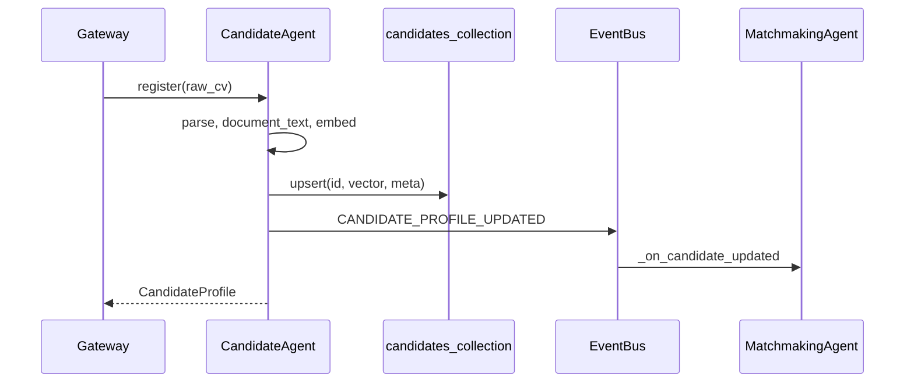
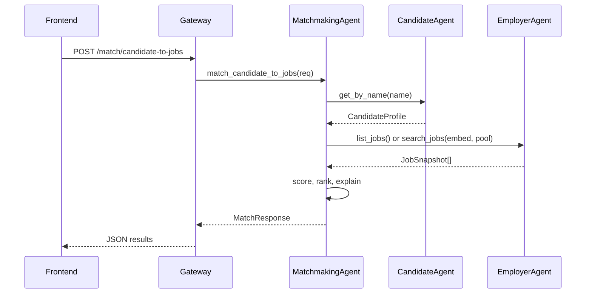

# Software Design Document (SDD)
## Multi-Agent Job Matching System

**Version:** 1.0  
**Date:** 2026-05-27  
**Status:** Draft · awaiting approval before implementation  
**Parent:** [HLD-multi-agent-system.md](./HLD-multi-agent-system.md) v1.0  
**Authors:** Harsh Kashyap, Taranumpreet Kaur Wasu  

---

## 1. Purpose

This SDD specifies **implementable** design for the greenfield multi-agent system: package layout, classes, interfaces, Pydantic schemas, event contracts, REST API, matching algorithm, configuration, bootstrap sequence, and test plan.

**Implementation gate:** No Python application code until this document is approved.

---

## 2. HLD decisions resolved

| # | HLD open item | SDD decision |
|---|---------------|--------------|
| 1 | Vector store layout | One `VectorStoreFactory`; two collections: `candidates_collection`, `jobs_collection` |
| 2 | UI match retrieval | **Exhaustive** over all jobs/resumes (corpus ≤15 jobs); **ANN** for daily batch (`candidate_pool=120`) |
| 3 | Who exposes ANN search | **Employer Agent** exposes `search_jobs`; **Candidate Agent** exposes `search_candidates`; Matchmaker calls these · never writes to stores |
| 4 | Naming | Code: `CandidateAgent`, `EmployerAgent`, `MatchmakingAgent`; UI label alias "Client" optional |

---

## 3. Repository layout

```text
Job-Matching-Agentic/
├── README.md
├── pyproject.toml                 # or requirements-min.txt + requirements-dev.txt
├── data/
│   ├── cvs.json                   # preserved eval corpus
│   ├── jobs.json
│   ├── eval_pairs.json
│   └── daily_recommendations_*.json   # runtime output (gitignored)
├── backend/
│   ├── main.py                    # uvicorn entry: create_app()
│   ├── config.py                  # Settings from env
│   ├── bootstrap.py               # wire bus + agents + gateway
│   │
│   ├── agents/
│   │   ├── __init__.py
│   │   ├── base.py                # BaseAgent, AgentContext
│   │   ├── candidate_agent.py
│   │   ├── employer_agent.py
│   │   └── matchmaking_agent.py
│   │
│   ├── bus/
│   │   ├── __init__.py
│   │   ├── event_bus.py           # AgentEventBus
│   │   └── events.py              # event type enums + payload models
│   │
│   ├── contracts/
│   │   ├── __init__.py
│   │   ├── interfaces.py          # Protocols: ICandidateAgent, etc.
│   │   ├── snapshots.py             # CandidateSnapshot, JobSnapshot
│   │   ├── profiles.py              # CandidateProfile, JobProfile
│   │   ├── matching.py              # MatchRequest, MatchResult, StrategyConfig
│   │   └── agent_status.py          # AgentStatusResponse
│   │
│   ├── core/
│   │   ├── document_text.py       # normative templates (field order preserved)
│   │   ├── skill_catalog.py
│   │   ├── embedding.py           # SentenceTransformer singleton
│   │   ├── similarity.py          # cosine, euclidean-derived
│   │   ├── skills.py              # Jaccard + soft embed
│   │   ├── scoring.py             # compute_semantic, compute_multimodal_weighted
│   │   ├── rrf.py                 # reciprocal rank fusion
│   │   └── explain.py             # rule-based why_ranked (v1)
│   │
│   ├── hooks/
│   │   ├── __init__.py
│   │   ├── parser.py              # Parser protocol + JsonParser (v1)
│   │   └── explainer.py           # Explainer protocol + RuleExplainer (v1)
│   │
│   ├── stores/
│   │   ├── base.py
│   │   ├── chroma_store.py
│   │   ├── qdrant_store.py
│   │   └── factory.py
│   │
│   ├── gateway/
│   │   ├── __init__.py
│   │   ├── app.py                 # FastAPI factory
│   │   └── routes/
│   │       ├── candidates.py
│   │       ├── employers.py
│   │       ├── matching.py
│   │       ├── agents.py          # GET /agents/status
│   │       └── system.py          # vector store config
│   │
│   └── benchmarks/                # preserved drivers (adapt imports to agents)
│       ├── paper_progression.py
│       ├── phase11.py
│       └── metrics.py
│
├── frontend/
│   ├── src/
│   │   ├── main.jsx
│   │   ├── App.jsx
│   │   ├── api/client.js
│   │   └── components/
│   │       ├── AgentStatusPanel.jsx
│   │       ├── MatchControls.jsx
│   │       └── ResultsPanel.jsx
│   └── ...
│
├── tests/
│   ├── conftest.py
│   ├── unit/
│   │   ├── test_event_bus.py
│   │   ├── test_candidate_agent.py
│   │   ├── test_employer_agent.py
│   │   ├── test_matchmaking_agent.py
│   │   ├── test_scoring.py
│   │   └── test_snapshots.py
│   ├── integration/
│   │   ├── test_bootstrap.py
│   │   ├── test_match_flow.py
│   │   └── test_api_gateway.py
│   └── benchmarks/
│       └── test_eval_regression.py
│
└── docs/design/
    ├── HLD-multi-agent-system.md
    └── SDD-multi-agent-system.md   # this file
```

---

## 4. Class diagram


---

## 5. Interface definitions (Protocols)

File: `backend/contracts/interfaces.py`

```python
from typing import Protocol, runtime_checkable
from contracts.snapshots import CandidateSnapshot, JobSnapshot
from contracts.profiles import CandidateProfile, JobProfile
from contracts.matching import MatchRequest, MatchResponse, EnsembleRequest, DailyBatchRequest, DailyBatchResponse
from contracts.agent_status import AgentStatus
import numpy as np


@runtime_checkable
class ICandidateAgent(Protocol):
    agent_id: str

    def register(self, raw: dict) -> CandidateProfile: ...
    def get_by_id(self, candidate_id: str) -> CandidateProfile | None: ...
    def get_by_name(self, name: str) -> CandidateProfile | None: ...
    def list_names(self) -> list[str]: ...
    def list_profiles(self) -> list[CandidateProfile]: ...
    def snapshot(self, candidate_id: str) -> CandidateSnapshot: ...
    def search_candidates(self, query_vector: np.ndarray, k: int) -> list[CandidateSnapshot]: ...
    def status(self) -> AgentStatus: ...


@runtime_checkable
class IEmployerAgent(Protocol):
    agent_id: str

    def register(self, raw: dict) -> JobProfile: ...
    def get_by_id(self, job_id: str) -> JobProfile | None: ...
    def get_by_title(self, title: str) -> JobProfile | None: ...
    def list_titles(self) -> list[str]: ...
    def list_jobs(self) -> list[JobProfile]: ...
    def snapshot(self, job_id: str) -> JobSnapshot: ...
    def search_jobs(self, query_vector: np.ndarray, k: int) -> list[JobSnapshot]: ...
    def status(self) -> AgentStatus: ...


@runtime_checkable
class IMatchmakingAgent(Protocol):
    agent_id: str

    def match_candidate_to_jobs(self, req: MatchRequest) -> MatchResponse: ...
    def match_job_to_candidates(self, req: MatchRequest) -> MatchResponse: ...
    def match_ensemble(self, req: EnsembleRequest) -> MatchResponse: ...
    def run_daily_batch(self, req: DailyBatchRequest) -> DailyBatchResponse: ...
    def status(self) -> AgentStatus: ...


@runtime_checkable
class VectorStorePort(Protocol):
    collection_name: str

    def upsert(self, entity_id: str, vector: np.ndarray, metadata: dict) -> None: ...
    def search(self, query_vector: np.ndarray, k: int) -> list[SearchHit]: ...
    def delete(self, entity_id: str) -> None: ...
    def count(self) -> int: ...


@runtime_checkable
class Parser(Protocol):
    def parse_candidate(self, raw: dict) -> CandidateProfile: ...
    def parse_job(self, raw: dict) -> JobProfile: ...


@runtime_checkable
class Explainer(Protocol):
    def explain(self, candidate: CandidateSnapshot, job: JobSnapshot, scores: ScoreBreakdown) -> list[str]: ...
```

**Rule:** `MatchmakingAgent` depends only on `ICandidateAgent` and `IEmployerAgent`, never on concrete store classes.

---

## 6. Data models (Pydantic v2)

File: `backend/contracts/profiles.py`

```python
class CandidateProfile(BaseModel):
    id: str
    name: str
    skills: list[str]
    experience_years: int
    preferred_salary: int | None = None
    remote_preference: bool = False
    summary: str = ""
    version: int = 1
    document_text: str = ""          # populated at register
    document_text_hash: str = ""     # sha256 hex
    embedding: list[float] | None = None   # 384-d; omitted in API list views


class JobProfile(BaseModel):
    id: str
    title: str
    required_skills: list[str]
    required_experience: int
    budget: int | None = None
    remote_policy: bool = False
    description: str = ""
    company: str | None = None
    location: str | None = None
    job_type: str | None = None
    link: str | None = None
    version: int = 1
    document_text: str = ""
    document_text_hash: str = ""
    embedding: list[float] | None = None
```

File: `backend/contracts/snapshots.py`

```python
class CandidateSnapshot(BaseModel):
    """Immutable view for matchmaker · no private agent internals."""
    id: str
    name: str
    skills: list[str]
    experience_years: int
    remote_preference: bool
    summary: str
    version: int
    document_text_hash: str
    embedding: list[float]           # required for scoring


class JobSnapshot(BaseModel):
    id: str
    title: str
    required_skills: list[str]
    required_experience: int
    remote_policy: bool
    description: str
    version: int
    document_text_hash: str
    embedding: list[float]
```

File: `backend/contracts/matching.py`

```python
Strategy = Literal["semantic", "multimodal"]
Metric = Literal["cosine", "euclidean"]
SkillsMode = Literal["jaccard", "embedding"]   # embedding = soft overlap; benchmark + future API


class StrategyConfig(BaseModel):
    strategy: Strategy = "semantic"
    metric: Metric = "cosine"
    semantic_weight: float = 0.7                 # multimodal only
    skills_mode: SkillsMode = "jaccard"
    weight: float = 1.0                          # ensemble list weight


class MatchRequest(BaseModel):
    query_key: str                               # candidate name OR job title
    top_k: int = Field(default=5, ge=1, le=50)
    strategy: Strategy = "semantic"
    metric: Metric = "cosine"
    skills_mode: SkillsMode = "jaccard"
    semantic_weight: float = 0.7
    retrieval: Literal["exhaustive", "ann"] = "exhaustive"
    candidate_pool: int = Field(default=120, ge=1)  # ann only


class EnsembleSearchConfig(BaseModel):
    strategy: Strategy
    metric: Metric
    weight: float = 1.0
    skills_mode: SkillsMode = "jaccard"
    semantic_weight: float = 0.7


class EnsembleRequest(BaseModel):
    query_key: str
    top_k: int = 5
    searches: list[EnsembleSearchConfig] = Field(min_length=1)
    retrieval: Literal["exhaustive", "ann"] = "exhaustive"
    candidate_pool: int = 120


class ScoreBreakdown(BaseModel):
    semantic_score: float
    skills_score: float | None = None
    final_score: float
    strategy_used: str
    metric_used: str
    skills_mode_used: str | None = None


class MatchResult(BaseModel):
    target_id: str                               # job_id or candidate_id
    target_label: str                            # job title or candidate name
    rank: int
    similarity: float
    semantic_score: float
    skills_score: float | None = None
    why_ranked: list[str] = []
    sources: list[EnsembleSource] | None = None  # ensemble only


class MatchResponse(BaseModel):
    session_id: str
    direction: Literal["candidate_to_jobs", "job_to_candidates"]
    query_label: str
    strategy_used: str
    results: list[MatchResult]
    corpus_size: int
    evaluated_count: int
    agent_versions: dict[str, int]               # {candidate: 3, employer: 2}


class DailyBatchRequest(BaseModel):
    top_k: int = 5
    strategy: Strategy = "semantic"
    metric: Metric = "cosine"
    candidate_pool: int = 120
    max_users: int = 0                           # 0 = all candidates
    output_path: str | None = None


class DailyBatchResponse(BaseModel):
    output_file: str
    users_processed: int
    generated_at_utc: str
```

File: `backend/contracts/agent_status.py`

```python
class AgentStatus(BaseModel):
    agent_id: str                                # "candidate" | "employer" | "matchmaking"
    display_name: str
    entity_count: int
    store_version: int
    vector_store_backend: str
    last_event: str | None = None
    last_event_at: str | None = None
    healthy: bool = True
```

---

## 7. Event bus and schemas

File: `backend/bus/events.py`

```python
class EventType(str, Enum):
    CANDIDATE_PROFILE_UPDATED = "candidate.profile.updated"
    JOB_PROFILE_UPDATED = "job.profile.updated"
    CORPUS_BOOTSTRAPPED = "system.corpus.bootstrapped"
    MATCH_REQUESTED = "match.requested"
    MATCH_COMPLETED = "match.completed"


class AgentEvent(BaseModel):
    event_type: EventType
    timestamp: datetime
    publisher_id: str
    payload: dict


class CandidateProfileUpdatedPayload(BaseModel):
    candidate_id: str
    version: int


class JobProfileUpdatedPayload(BaseModel):
    job_id: str
    version: int


class CorpusBootstrappedPayload(BaseModel):
    candidate_count: int
    job_count: int
    candidate_store_version: int
    job_store_version: int


class MatchCompletedPayload(BaseModel):
    session_id: str
    direction: str
    query_label: str
    top_k: int
    result_count: int
```

File: `backend/bus/event_bus.py`

```python
class AgentEventBus:
    """In-process synchronous pub-sub. Handlers run in publisher thread."""

    def subscribe(self, event_type: EventType, handler: Callable[[AgentEvent], None]) -> None: ...
    def publish(self, event: AgentEvent) -> None: ...   # invokes all handlers; swallows handler exceptions with log
    def clear(self) -> None: ...                         # tests only
```

**Matchmaker subscriptions (bootstrap):**

```python
bus.subscribe(EventType.CANDIDATE_PROFILE_UPDATED, matchmaker._on_candidate_updated)
bus.subscribe(EventType.JOB_PROFILE_UPDATED, matchmaker._on_job_updated)
```

**Invalidation logic:**

```python
def _on_candidate_updated(self, event: AgentEvent) -> None:
    self.state.index_fingerprint.candidate_version = event.payload["version"]
    self.state.candidate_cache.clear()

def _on_job_updated(self, event: AgentEvent) -> None:
    self.state.index_fingerprint.job_version = event.payload["version"]
    self.state.job_list_cache.clear()
```

---

## 8. Agent class specifications

### 8.1 CandidateAgent

File: `backend/agents/candidate_agent.py`

| Method | Behavior |
|--------|----------|
| `register(raw)` | `parser.parse_candidate` → build `document_text` → canonicalize skills → embed → upsert store → bump `store_version` → save profile → publish `CANDIDATE_PROFILE_UPDATED` |
| `get_by_name(name)` | Linear scan O(n); n≤30 acceptable |
| `snapshot(id)` | Return `CandidateSnapshot` without salary (not used in scoring) |
| `search_candidates(vector, k)` | Delegate to store; map hits → snapshots |
| `bootstrap_from_file(path)` | Load JSON array; `register` each; return count |

**State:**

```python
@dataclass
class CandidateAgentState:
    profiles: dict[str, CandidateProfile] = field(default_factory=dict)
    name_index: dict[str, str] = field(default_factory=dict)   # name → id
    store_version: int = 0
```

### 8.2 EmployerAgent

Mirror of CandidateAgent for jobs. Collection: `jobs_collection`. Event: `JOB_PROFILE_UPDATED`.

### 8.3 MatchmakingAgent

File: `backend/agents/matchmaking_agent.py`

| Method | Behavior |
|--------|----------|
| `match_candidate_to_jobs` | Resolve candidate via `ICandidateAgent.get_by_name`; retrieve jobs (exhaustive or ANN); score; rank; explain; publish `MATCH_COMPLETED` |
| `match_job_to_candidates` | Reverse direction |
| `match_ensemble` | For each search config, produce ranked list → `rrf_fuse(k=60)` → attach `sources[]` |
| `run_daily_batch` | Loop candidates; ANN pool per candidate; write JSON artifact |

**Session ID:** `uuid4()` string per match request.

**Ring buffer:** last 50 `MatchSession` summaries in state (for agent status / debug).

---

## 9. Matching algorithm (detailed)

File: `backend/core/scoring.py`

### 9.1 Pseudocode

```text
Algorithm MATCH_CANDIDATE_TO_JOBS(candidate, jobs[], config, top_k)

  INPUT:
    candidate : CandidateSnapshot
    jobs      : JobSnapshot[]          // exhaustive or ANN shortlist
    config    : StrategyConfig
    top_k     : int

  OUTPUT:
    ranked : MatchResult[]

  for each job in jobs:
    sem ← COSINE_SIM(candidate.embedding, job.embedding)
        if config.metric = euclidean:
            sem ← 1 / (1 + L2(candidate.embedding, job.embedding))

    if config.strategy = semantic:
      final ← sem
      skills ← NULL
    else:
      if config.skills_mode = jaccard:
        skills ← JACCARD(canonical(candidate.skills), canonical(job.required_skills))
      else:
        skills ← SOFT_OVERLAP(candidate.skills, job.required_skills)
      final ← config.semantic_weight * sem + (1 - config.semantic_weight) * skills

    append (job, sem, skills, final)

  sort by final descending
  assign rank 1..|jobs|
  return top top_k with explain(candidate, job, scores)
```

### 9.2 Soft overlap (preserved formula)

```python
def soft_overlap(resume_skills: list[str], job_skills: list[str]) -> float:
    if not resume_skills or not job_skills:
        return 0.0
    per_job = []
    for j in job_skills:
        j_vec = embed_skill(j)   # cached
        best = max(cosine(j_vec, embed_skill(r)) for r in resume_skills)
        per_job.append(best)
    return mean(per_job)
```

### 9.3 RRF (ensemble)

```python
def rrf_fuse(runs: list[list[RankedItem]], key_fn, k: int = 60) -> list[FusedItem]:
    scores = defaultdict(float)
    for run in runs:
        for rank, item in enumerate(run, start=1):
            scores[key_fn(item)] += item.weight * (1.0 / (k + rank))
    return sort_by_score(scores)
```

### 9.4 Retrieval modes

| Mode | When | Implementation |
|------|------|----------------|
| `exhaustive` | UI match (default) | `employer_agent.list_jobs()` → snapshots |
| `ann` | Daily batch | `employer_agent.search_jobs(candidate.embedding, min(pool, count))` |

### 9.5 Explanation (v1 rule-based)

File: `backend/core/explain.py`

Bullets (max 4):
1. Skill overlap: intersection of lowercased skill sets  
2. Title/summary token overlap (≥2 tokens)  
3. Semantic band: ≥0.65 high, ≥0.5 moderate  
4. Multimodal note if strategy=multimodal  

---

## 10. Bootstrap and dependency injection

File: `backend/bootstrap.py`

```python
def create_system(settings: Settings) -> SystemContainer:
    bus = AgentEventBus()
    store_factory = VectorStoreFactory(settings)
    candidate_store = store_factory.create("candidates_collection")
    job_store = store_factory.create("jobs_collection")
    parser = JsonParser()
    embedder = EmbeddingService(settings.embedding_model)

    candidate_agent = CandidateAgent(
        bus=bus, store=candidate_store, parser=parser, embedder=embedder, settings=settings
    )
    employer_agent = EmployerAgent(
        bus=bus, store=job_store, parser=parser, embedder=embedder, settings=settings
    )
    scorer = ScoringEngine(embedder=embedder)
    explainer = RuleExplainer()
    matchmaker = MatchmakingAgent(
        bus=bus,
        candidate_agent=candidate_agent,
        employer_agent=employer_agent,
        scorer=scorer,
        explainer=explainer,
    )

    # wire subscriptions
    matchmaker.register_handlers(bus)

    # load corpus
    n_c = candidate_agent.bootstrap_from_file(settings.data_dir / "cvs.json")
    n_j = employer_agent.bootstrap_from_file(settings.data_dir / "jobs.json")

    bus.publish(AgentEvent(
        event_type=EventType.CORPUS_BOOTSTRAPPED,
        publisher_id="system",
        payload=CorpusBootstrappedPayload(...).model_dump(),
    ))

    return SystemContainer(bus=bus, candidate=candidate_agent, employer=employer_agent, matchmaker=matchmaker)
```

File: `backend/main.py`

```python
def create_app() -> FastAPI:
    container = create_system(Settings())
    return build_gateway(container)
```

---

## 11. REST API specification

Base URL: `http://localhost:8000`  
All JSON request/response bodies. FastAPI auto-generates OpenAPI at `/docs`.

### 11.1 Agent observability

| Method | Path | Handler | Response |
|--------|------|---------|----------|
| GET | `/agents/status` | all agents `.status()` | `{ candidates: AgentStatus, employer: AgentStatus, matchmaking: AgentStatus }` |
| GET | `/agents/events/recent` | bus ring log (optional v1.1) | `{ events: AgentEvent[] }` last 20 |

### 11.2 Candidate agent routes

| Method | Path | Body | Response |
|--------|------|------|----------|
| GET | `/candidates` | · | `{ names: string[] }` |
| GET | `/candidates/full` | · | `CandidateProfile[]` (embeddings omitted) |
| GET | `/candidates/{name}` | · | `CandidateProfile` or 404 |
| POST | `/candidates` | raw CV JSON | `CandidateProfile` 201 |

### 11.3 Employer agent routes

| Method | Path | Body | Response |
|--------|------|------|----------|
| GET | `/jobs` | · | `{ titles: string[] }` |
| GET | `/jobs/full` | · | `JobProfile[]` |
| GET | `/jobs/{title}` | · | `JobProfile` or 404 |
| POST | `/jobs` | raw job JSON | `JobProfile` 201 |

### 11.4 Matchmaking routes

| Method | Path | Body | Response |
|--------|------|------|----------|
| POST | `/match/candidate-to-jobs` | `MatchRequest` (query_key=name) | `MatchResponse` |
| POST | `/match/job-to-candidates` | `MatchRequest` (query_key=title) | `MatchResponse` |
| POST | `/match/ensemble` | `EnsembleRequest` | `MatchResponse` |
| POST | `/match/daily-batch` | `DailyBatchRequest` | `DailyBatchResponse` |

**Legacy alias routes (optional, for benchmark/UI migration):**

| Legacy | New |
|--------|-----|
| POST `/match-resume` | POST `/match/candidate-to-jobs` |
| POST `/match-job` | POST `/match/job-to-candidates` |
| POST `/match-resume-ensemble` | POST `/match/ensemble` |
| POST `/agent/run-daily-recommendations` | POST `/match/daily-batch` |

### 11.5 System routes

| Method | Path | Body | Response |
|--------|------|------|----------|
| GET | `/system/config` | · | `{ vector_store, strategies, metrics, skills_modes }` |
| POST | `/system/vector-store` | `{ vector_store: "chroma"\|"qdrant" }` | triggers re-bootstrap reindex |

### 11.6 Error responses

```python
class ErrorResponse(BaseModel):
    error: str
    code: str          # NOT_FOUND | VALIDATION | AGENT_ERROR
```

| Condition | HTTP | code |
|-----------|------|------|
| Unknown candidate/job | 404 | NOT_FOUND |
| Empty ensemble searches | 400 | VALIDATION |
| Invalid vector_store | 422 | VALIDATION |

---

## 12. Configuration

File: `backend/config.py`

```python
class Settings(BaseSettings):
    model_config = SettingsConfigDict(env_file=".env", extra="ignore")

    data_dir: Path = Path("data")
    embedding_model: str = "all-MiniLM-L6-v2"
    vector_store: Literal["chroma", "qdrant"] = "chroma"
    chroma_persist_dir: Path = Path("backend/chroma_db")
    qdrant_persist_dir: Path = Path("backend/qdrant_db")
    chroma_space: Literal["cosine", "l2"] = "cosine"
    default_strategy: Strategy = "semantic"
    default_metric: Metric = "cosine"
    rrf_k: int = 60
    host: str = "0.0.0.0"
    port: int = 8000
```

Environment variables mirror legacy names where possible (`VECTOR_STORE`, `EMBEDDING_MODEL`, `CHROMA_SPACE`).

---

## 13. Vector store adapter

File: `backend/stores/chroma_store.py`

```python
class ChromaVectorStore:
    collection_name: str

    def upsert(self, entity_id: str, vector: np.ndarray, metadata: dict) -> None:
        # flatten list fields in metadata to comma-separated strings

    def search(self, query_vector: np.ndarray, k: int) -> list[SearchHit]:
        # returns entity_id, distance, metadata

class SearchHit(BaseModel):
    entity_id: str
    distance: float
    metadata: dict
```

**Collection naming:**
- `candidates_collection`
- `jobs_collection`

Phase11 benchmarks may append suffix via env `CHROMA_COLLECTION_SUFFIX` / `QDRANT_COLLECTION_SUFFIX`.

---

## 14. LLM hooks (v1 stubs)

File: `backend/hooks/parser.py`

```python
class JsonParser:
    """v1: Pydantic validation only."""
    def parse_candidate(self, raw: dict) -> CandidateProfile: ...
    def parse_job(self, raw: dict) -> JobProfile: ...


class LlmParser(Parser):  # v2 stub · raises NotImplementedError until configured
    ...
```

File: `backend/hooks/explainer.py`

```python
class RuleExplainer:
    def explain(self, candidate, job, scores) -> list[str]: ...


class LlmExplainer(Explainer):  # v2 stub
    ...
```

Factory in `bootstrap.py` selects implementation via `settings.parser_backend = "json" | "llm"`.

---

## 15. Frontend integration

File: `frontend/src/api/client.js`

| UI action | API call |
|-----------|----------|
| Load dropdowns | GET `/candidates`, GET `/jobs` |
| Agent panel | GET `/agents/status` (poll every 10s or on match) |
| Run match | POST `/match/candidate-to-jobs` or `/match/job-to-candidates` |
| Ensemble | POST `/match/ensemble` |
| Daily batch | POST `/match/daily-batch` |
| Switch store | POST `/system/vector-store` |

**New component:** `AgentStatusPanel.jsx` · three cards showing `entity_count`, `store_version`, `last_event`, `healthy`.

**Env:** `VITE_API_BASE_URL=http://localhost:8000`

---

## 16. Benchmark integration

Benchmarks remain under `backend/benchmarks/` but import scoring from `core/` and optionally bootstrap via `create_system()`:

```python
# paper_progression.py adaptation
system = create_system(Settings())
matchmaker = system.matchmaker
# run ladder using matchmaker.match_candidate_to_jobs with skills_mode override
```

**Regression gate:** `tests/benchmarks/test_eval_regression.py` runs progression summary and asserts nDCG floats within ε=1e-6 of committed `data/expected/paper_progression_summary.json`.

---

## 17. Sequence diagrams

### 17.1 Register candidate



### 17.2 Match flow



---

## 18. Test plan

### 18.1 Unit tests

| Test file | Cases |
|-----------|-------|
| `test_event_bus.py` | subscribe/publish; multiple handlers; handler exception logged not raised |
| `test_candidate_agent.py` | register bumps version; publishes event; get_by_name; snapshot immutability |
| `test_employer_agent.py` | same for jobs |
| `test_matchmaking_agent.py` | mock ICandidateAgent/IEmployerAgent; exhaustive rank order; cache invalidation on event |
| `test_scoring.py` | semantic-only; multimodal jaccard w=0.7; soft overlap perfect match; invalid weight |
| `test_snapshots.py` | snapshot excludes internal fields; embedding required |
| `test_rrf.py` | consensus ordering matches legacy `research_sweep` fixture |
| `test_explain.py` | bullets for high semantic, skill overlap |

### 18.2 Integration tests

| Test file | Cases |
|-----------|-------|
| `test_bootstrap.py` | loads 30 candidates + 15 jobs; store counts; CORPUS_BOOTSTRAPPED fired |
| `test_match_flow.py` | end-to-end Rahul Sharma → ML Engineer rank 1 (eval pair) |
| `test_api_gateway.py` | all routes 200/404; OpenAPI schema valid |
| `test_agent_isolation.py` | matchmaker cannot import candidate store directly (lint or architectural test) |

### 18.3 Benchmark regression

| Test | Assert |
|------|--------|
| `test_eval_regression.py` | soft embed nDCG@5 ≈ 0.968515; semantic ≈ 0.911094 |
| `test_eval_pairs_integrity.py` | 47 pairs, 30 queries unchanged |

**Target:** ≥40 tests in v1; expand to 63+ as features parity with legacy.

### 18.4 Test fixtures (`conftest.py`)

```python
@pytest.fixture
def event_bus() -> AgentEventBus: ...

@pytest.fixture
def system(tmp_path) -> SystemContainer:
    # copy data/*.json to tmp_path; create_system with test settings

@pytest.fixture
def sample_candidate() -> CandidateProfile: ...  # Rahul Sharma
@pytest.fixture
def sample_job() -> JobProfile: ...                # ML Engineer
```

---

## 19. Implementation order (post-SDD approval)

| Step | Deliverable | Est. |
|------|-------------|------|
| 1 | `contracts/`, `bus/`, `config.py` | 0.5 day |
| 2 | `core/` (document_text, embedding, scoring) | 1 day |
| 3 | `stores/` + factory | 0.5 day |
| 4 | `CandidateAgent`, `EmployerAgent` | 1 day |
| 5 | `MatchmakingAgent` + explain + rrf | 1 day |
| 6 | `bootstrap.py` + unit tests | 0.5 day |
| 7 | `gateway/` routes + integration tests | 1 day |
| 8 | Frontend agent panel + API client | 1 day |
| 9 | Benchmark adapter + regression gate | 1 day |

**Total:** ~7–8 dev days for v1.

---

## 20. Security and ethics (v1)

- No authentication (local demo / research corpus).  
- No PII beyond synthetic names in eval JSON.  
- `POST /candidates` and `POST /jobs` disabled in production demo mode via `settings.read_only=true` (optional).  
- Match results include `why_ranked` for transparency (Khan Part VIII guardrail).  
- Agent status endpoint documents corpus size and versions for auditability.

---

## 21. Approval

| Reviewer | Role | Approved | Date |
|----------|------|----------|------|
| Harsh Kashyap | Author | ☐ | |
| Taranumpreet Kaur Wasu | Author | ☐ | |
| Dr Parteek Bhatia | Supervisor | ☐ | |

**Next step after approval:** Phase 2 implementation · begin with `contracts/` + `bus/` + `core/document_text.py`.

---

## Appendix A · Document text templates (normative)

Resume (field order fixed for benchmark reproducibility):

```text
resume profile
name: {name}
experience_years: {years}
work_mode: remote|onsite
skills: {canonical sorted comma list}
summary: {text}
```

Job:

```text
job description
title: {title}
company: {company}
location: {location}
job_type: {job_type}
required_experience_years: {years}
work_mode: remote|onsite
required_skills: {canonical sorted list}
description: {text}
apply_link: {url}
```

## Appendix B · Mapping to paper sections

| Paper § | SDD section |
|---------|-------------|
| §3.1 Candidate Agent | §8.1, §11.2 |
| §3.2 Employer Agent | §8.2, §11.3 |
| §3.3 Matchmaking Agent | §8.3, §11.4 |
| §3.4 Agent Communication | §7 |
| §3.5 Workflow | §10, §17 |
| §4 Implementation | §3, §12, §14 |
| §5 Quality Metrics | §9, §16, §18.3 |
| Algorithm in paper | §9.1 |
