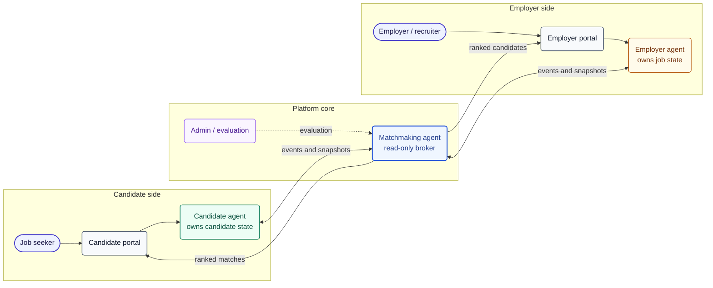
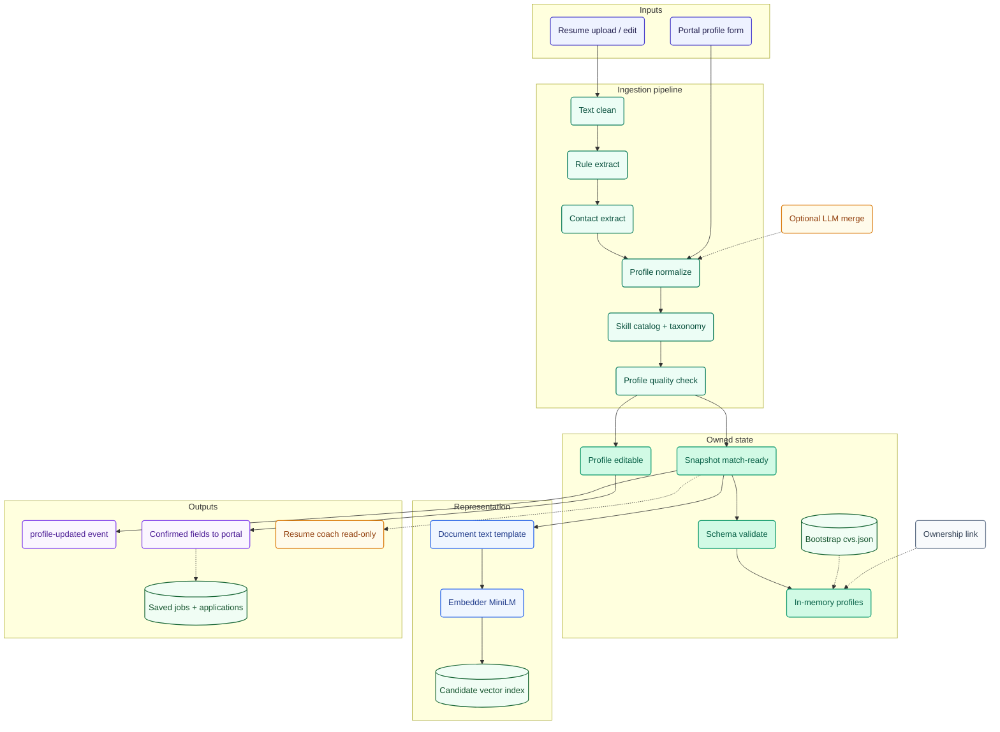
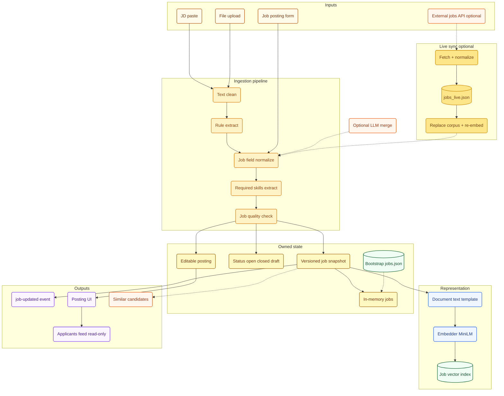
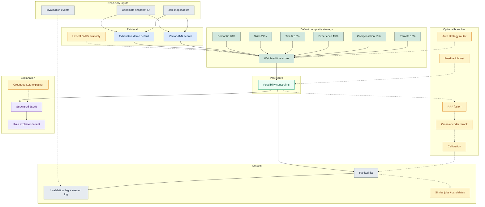
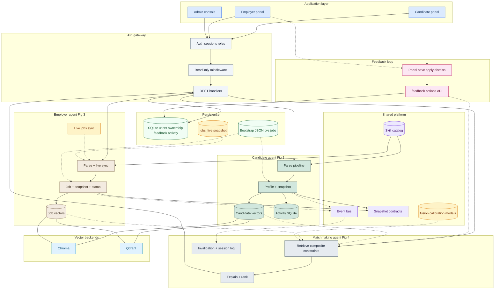
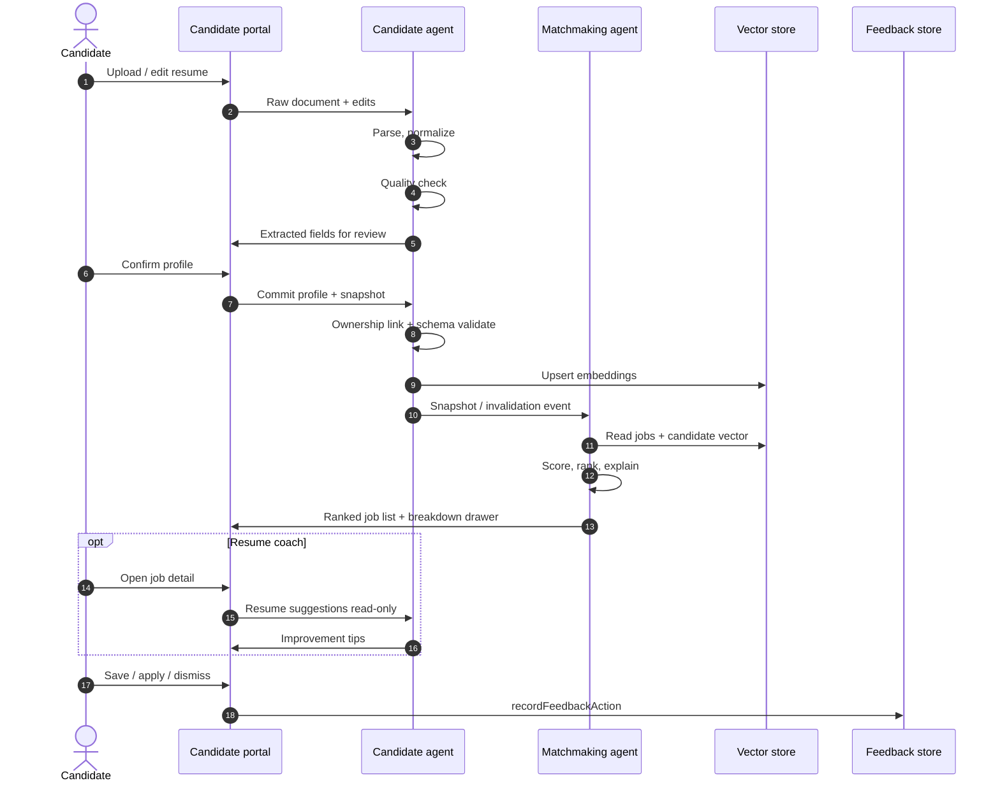
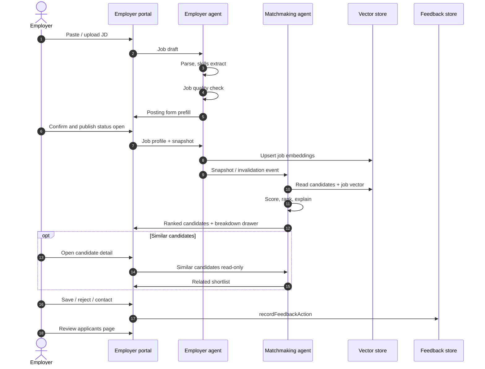
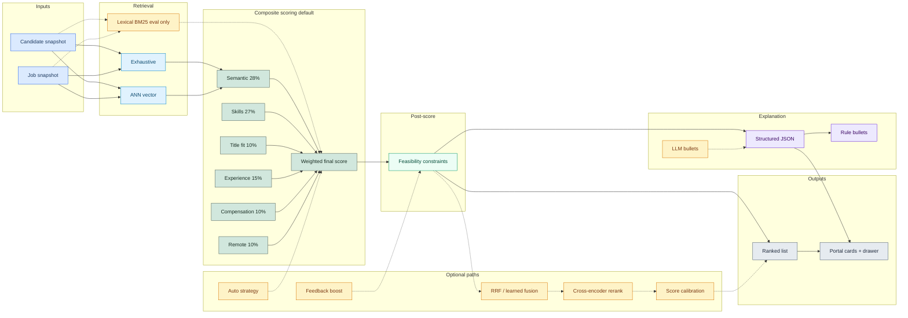
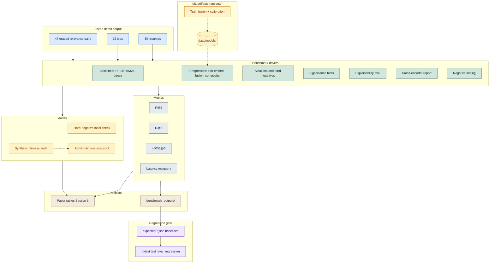

# JAAMAS figure designs (review before draw.io)

**Workflow:** Review Mermaid here → approve each figure → export to `source/FigN.drawio` → `python3 scripts/generate_jaamas_figures.py` → check `FigN.pdf` → `\JFigure` in manuscript.

**Rules:** Grayscale in final PDF; agent names match Section 3–Section 5; one idea per figure; dashed = read/event/optional, solid = owned path.

**Color policy:** Mermaid previews in this doc use **color for review only** (flowcharts via `classDef`; sequence diagrams use the default theme for Markdown preview compatibility). draw.io export for `FigN.pdf` converts to **grayscale** for Springer/JAAMAS print.

| Role | Preview color | Portal / agent |
|------|---------------|----------------|
| Sage green | `#d1e7dd` | Candidate agent & portal |
| Sand/warm | `#f3ebe0` | Employer agent & portal |
| Slate blue | `#e6ebf0` | Matchmaking agent |
| Sky blue | `#dbeafe` | UI layer |
| Violet | `#ede9fe` | Shared events / snapshots |
| Amber | `#fef3c7` | Optional / external API |
| Mint store | `#f0fdf4` | Vector stores |
| Gray auth | `#f1f5f9` | Auth / SQLite |

**Status key:** `draft` | `approved` | `drawio` | `done`

---

## Architecture ladder (professor spec)

Read figures **top-down** in Section 3, simple → per-agent → full detail.

| Fig | Name | Where in paper | Purpose |
|-----|------|----------------|---------|
| **1** | **HLD (simple)** | Start of Section 3 | 3 agents + 2 portals + users; one glance |
| **2** | **Candidate agent (expanded)** | Section 3.1 | Inner components of candidate-side agent |
| **3** | **Employer agent (expanded)** | Section 3.2 | Inner components of employer-side agent |
| **4** | **Matchmaking agent (expanded)** | Section 3.3 | Inner components of read-only matcher |
| **5** | **Full block architecture (detailed)** | End of Section 3 (before Section 3.4 comms) | All agents + stores + gateway + bus in one diagram |
| 6 | Candidate workflow (sequence) | Section 3.5 | End-user path |
| 7 | Employer workflow (sequence) | Section 3.5 | Mirror of Fig 6 |
| 8 | Matching pipeline | Section 4 | Implementation scoring path |
| 9 | Evaluation pipeline | Section 5 | Benchmark / regression |

**Manuscript:** `\JFigure` refs updated in `section-3/4/5 .tex`, Fig 1 HLD → Figs 2–4 agents → Fig 5 capstone → Figs 6–7 workflows → Figs 8–9 pipelines.

---

## Fig 1, HLD simple (Section 3 opening) `approved → synced source/Fig1.mmd → exported Fig1.png`

**Caption:** High-level view of JobMatch: two market-side agents own candidate and job state; a read-only Matchmaking agent scores pairings and returns explained rankings to role-specific portals.

**Rules:** Max **9 boxes**, no inner pipelines, no library names.

**Portal UI (footnote):** Onboarding stepper → profile form → quality panel on candidate side; JD import → job form on employer side.



**Review checklist**
- [x] Readable in 10 seconds
- [x] Only three agent boxes (no sub-components)
- [x] Agent ↔ matchmaking data flow clear (snapshots + invalidation events)

---

## Fig 2, Candidate agent expanded (Section 3.1) `approved → synced source/Fig2.mmd`

**Caption:** Internal structure of the Candidate/Client agent: document ingestion (clean, rule extract, optional LLM merge), skill normalization, profile quality check, editable profile vs match-ready snapshot, embedding, and side outputs (events, activity store, resume coach).

**Portal UI (footnote):** `Onboarding.jsx` stepper → `ProfileForm.jsx` → `ProfileQualityScore.jsx`.



**Review checklist**
- [x] Snapshot vs editable profile distinction visible
- [x] No arrows to employer store
- [x] Event emitted only after snapshot commit
- [x] Bootstrap JSON dashed (not live write path)

---

## Fig 3, Employer agent expanded (Section 3.2) `approved → synced source/Fig3.mmd`

**Caption:** Internal structure of the Employer agent: JD ingestion (clean, rules, optional LLM), job quality check, posting status lifecycle, optional external feed sync, job snapshots, and side outputs (events, applicants feed, similar candidates).



**Review checklist**
- [x] Live API path dashed/optional with full sync chain
- [x] Symmetric layout with Fig 2
- [x] Does not write candidate data
- [x] Job status lifecycle visible

---

## Fig 4, Matchmaking agent expanded (Section 3.3) `approved`

**Caption:** Internal structure of the read-only Matchmaking agent: retrieval (exhaustive or ANN; lexical eval-only), composite scoring (28/27/10/15/10/10 weights including title fit), feasibility constraints, optional fusion/rerank/calibration/feedback boost, rule or LLM explanations, and session invalidation log.

**API paths (footnote):** `/match/ensemble` (RRF), `/match/daily-batch` for batch recommendations.



**Review checklist**
- [x] All inputs labeled read-only
- [x] Default path solid; optional dashed
- [x] Title fit (10%) in composite
- [x] Constraints + explainer fork explicit
- [x] Lexical marked eval-only

---

## Fig 5, Full detailed block architecture (Section 3 capstone) `approved`

**Caption:** End-to-end block diagram: three portals (candidate, employer, admin console sub-zones), API gateway with auth and read-only middleware, three agents (abbreviated from Figs 2–4), persistence layer (SQLite, bootstrap JSON, vectors), shared platform, feedback loop, and vector backends (Chroma/Qdrant).

*Superset of Figs 2–4, every agent box maps to an expanded figure.*

**Admin console sub-zones:** agent health, event strip, vector switch, demo reset, live jobs sync, fairness snapshot, match eval controls.



**Review checklist**
- [x] Superset of Figs 2–4 (professor can map boxes)
- [x] Gateway + auth + read-only middleware visible
- [x] SQLite + feedback loop separate from vectors
- [x] Bootstrap vs runtime distinguished
- [x] Vector backend switch shown

---

## Fig 6, Candidate workflow (Section 3.5) `approved → synced source/Fig6.mmd`

**Caption:** Candidate workflow: resume upload, assisted parsing, quality check and form prefill, profile confirmation with ownership link, snapshot registration, vector upsert, ranked job discovery with explanation drawer, and explicit save/apply/dismiss actions recorded to the feedback store.



**Review checklist**
- [x] Human confirmation step before matching
- [x] Quality check → form prefill explicit
- [x] Explanation drawer on results
- [x] Save/apply/dismiss → feedback store (not auto-apply)
- [x] Optional resume coach path

---

## Fig 7, Employer workflow (Section 3.5) `approved → synced source/Fig7.mmd`

**Caption:** Employer workflow: JD ingestion, job quality check, posting confirmation with status open, snapshot registration, reverse candidate matching with explanation drawer, feedback actions (save/reject/contact), and applicants page review.



**Review checklist**
- [x] Symmetric structure with Fig 6
- [x] Job quality check + status=open
- [x] Explanation drawer + feedback terminal actions
- [x] Applicants page as parallel read path
- [x] No auto-hire language

---

## Fig 8, Matching pipeline (Section 4) `approved`

**Caption:** Implementation of the matching pipeline: retrieval (exhaustive or ANN primary; lexical benchmark-only), composite scoring with six weighted components (28/27/10/15/10/10), feasibility constraints, optional fusion/calibration/feedback boost/auto-strategy, and structured explanation fork (rule default, LLM optional) consumed by portal cards and drawer.

**Portal path callout:** Candidate and employer portals use fixed composite defaults; admin `MatchControls` exposes the full strategy matrix.



**Review checklist**
- [x] Title fit in composite (6 components)
- [x] Constraints after composite
- [x] Explanation fork visible
- [x] Lexical dashed eval-only
- [x] Portal vs admin path noted in caption

---

## Fig 9, Evaluation pipeline (Section 5) `approved`

**Caption:** Quality evaluation pipeline: frozen demo corpus, benchmark drivers (baselines, progression, ablations, significance, explainability, cross-encoder report, negative mining), metric aggregation, fairness audits, optional ML training of fusion/calibration artifacts, regression gates, and paper tables. Evaluation runs via CLI/pytest only (no portal UI).

**Orchestrator (footnote):** `run_research_pipeline.py` wraps drivers in a 9-stage offline suite.



**Review checklist**
- [x] Numbers are corpus sizes, not results
- [x] Extended driver set (significance, explainability, CE, negative mining)
- [x] ML train path dashed
- [x] Admin fairness hook dashed
- [x] No eval UI, CLI/pytest only

---

## Out of scope for figures

Components present in the codebase but intentionally omitted from paper figures (document here only):

| Component | Reason omitted |
|-----------|----------------|
| Legacy route aliases (`/match-resume`, `/match-job`, etc.) | Implementation detail; canonical paths in Section 4 text |
| `parser_backend` config field | Unused at runtime |
| Orphan UI: `ProfileQualityPanel.jsx`, `ProfileStrength.jsx` | Not wired in current portal tree |
| Premium / 402 error page | No billing flow implemented |
| Full 50-endpoint API catalog | Listed in Section 4 prose, not as a figure |
| `rerank_diagnostics` telemetry | Internal CE timing logs only |
| Unused API client exports (`createApplication`, `updateSavedJob`, `recordFeedback`) | Portal uses `recordFeedbackAction` instead |

---

## Fig 1 (legacy), superseded by ladder above

<details>
<summary>Old single-shot architecture (merged into Fig 5)</summary>

**Caption (old manuscript):** Multi-agent architecture of the proposed JobMatch recruitment system…

See Fig 5 for the capstone block diagram with full inner components.

</details>

---

## Order of work (professor ladder)

1. **Fig 1 HLD**, approved → draw.io → PDF  
2. **Fig 2** Candidate agent → **Fig 3** Employer → **Fig 4** Matchmaking, approved  
3. **Fig 5** Full block architecture, approved  
4. **Fig 6–7** Workflows, approved  
5. **Fig 8–9** Pipeline + evaluation, approved  
6. Export all to draw.io → regenerate PDFs → verify manuscript `\JFigure` paths

## Preview Mermaid locally

Open this file in VS Code with a Mermaid preview extension, or paste a block into [mermaid.live](https://mermaid.live).

After approval, sync approved diagram to `source/FigN.mmd` and regenerate draw.io via `scripts/generate_jaamas_figures.py` (or hand-edit `.drawio`).

**Quick export (all figures):**
```bash
cd docs/submission/jaamas/figures
bash export_all_mermaid.sh
```

## Readability guardrails (draw.io export)

- **Fig 1:** ≤9 boxes
- **Figs 2–4:** ≤18 boxes each; use subgraphs
- **Fig 5:** ≤28 boxes in zones; abbreviate vs Figs 2–4
- **Fig 8:** LR layout; optional paths dashed
- **All PDFs:** grayscale; color only in markdown preview
